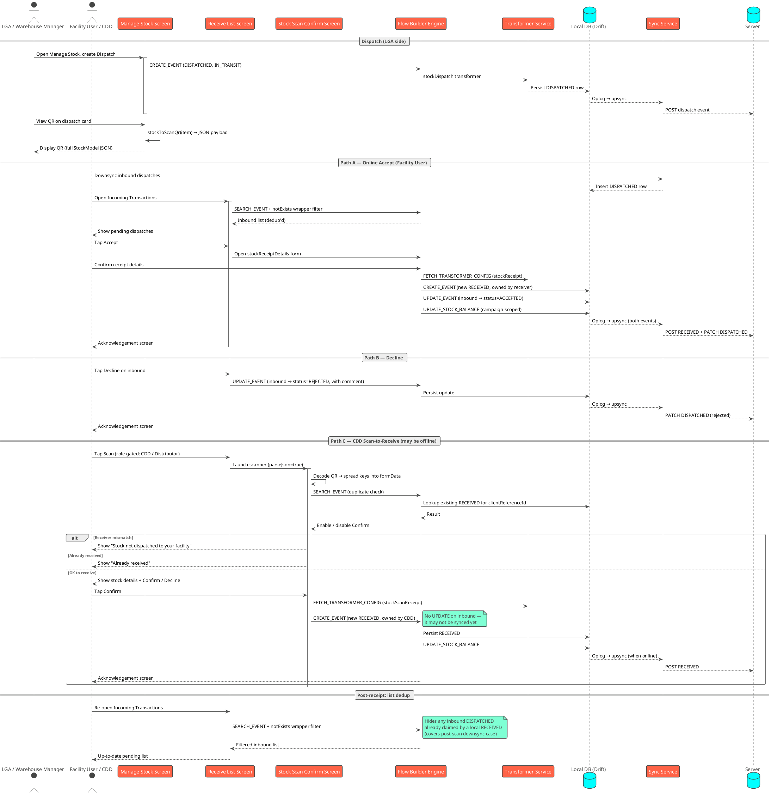
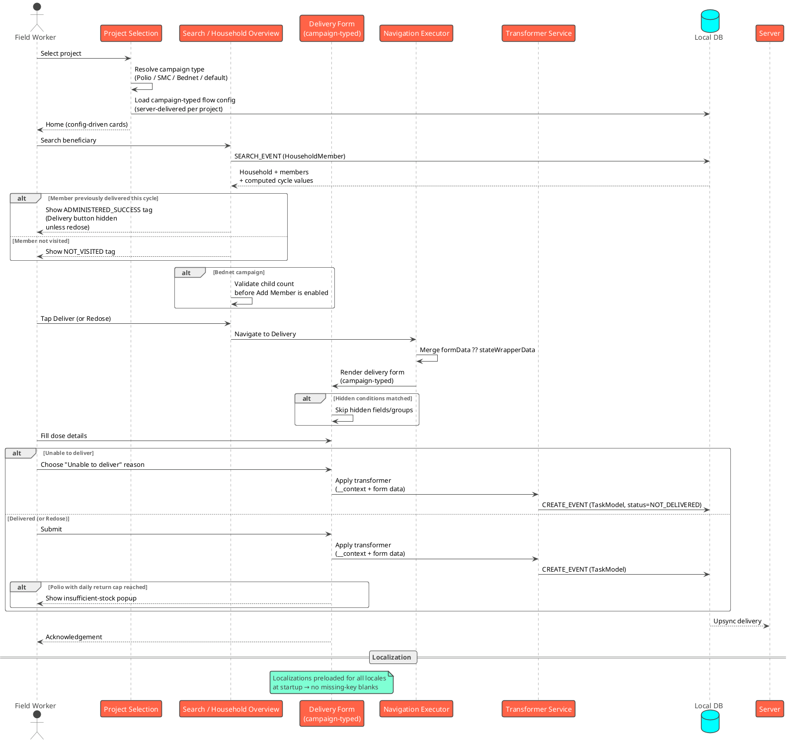
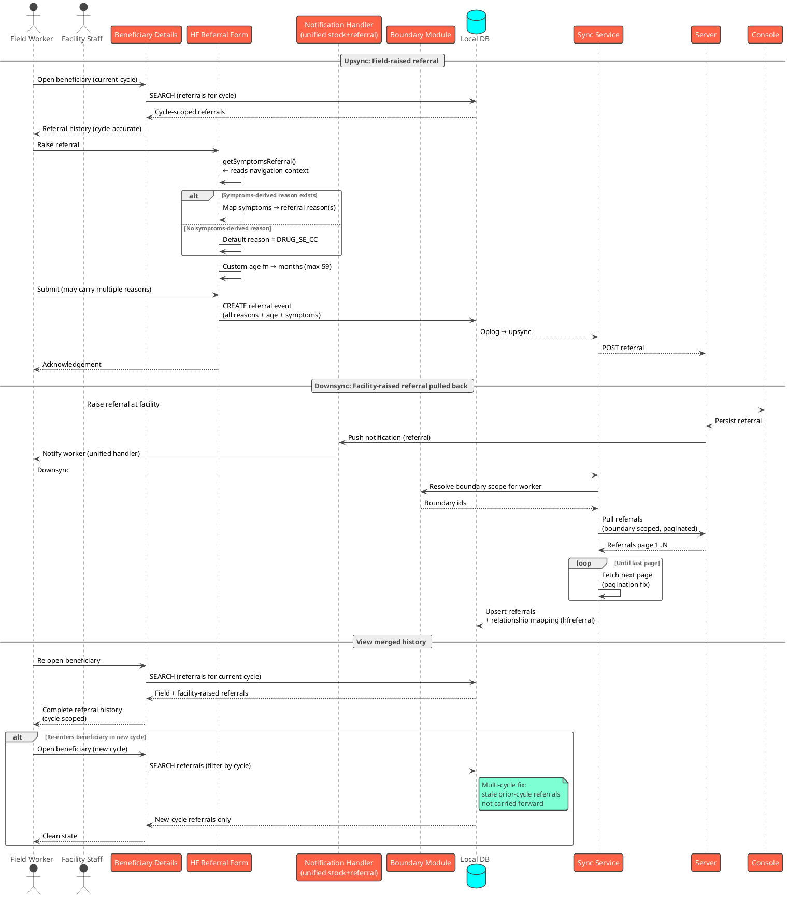
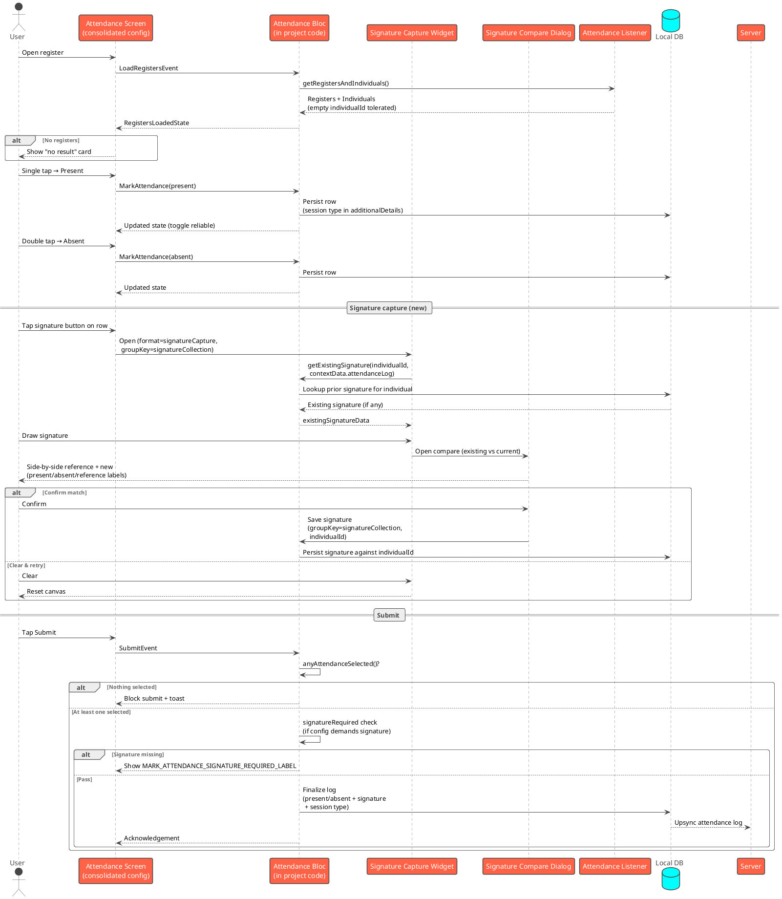
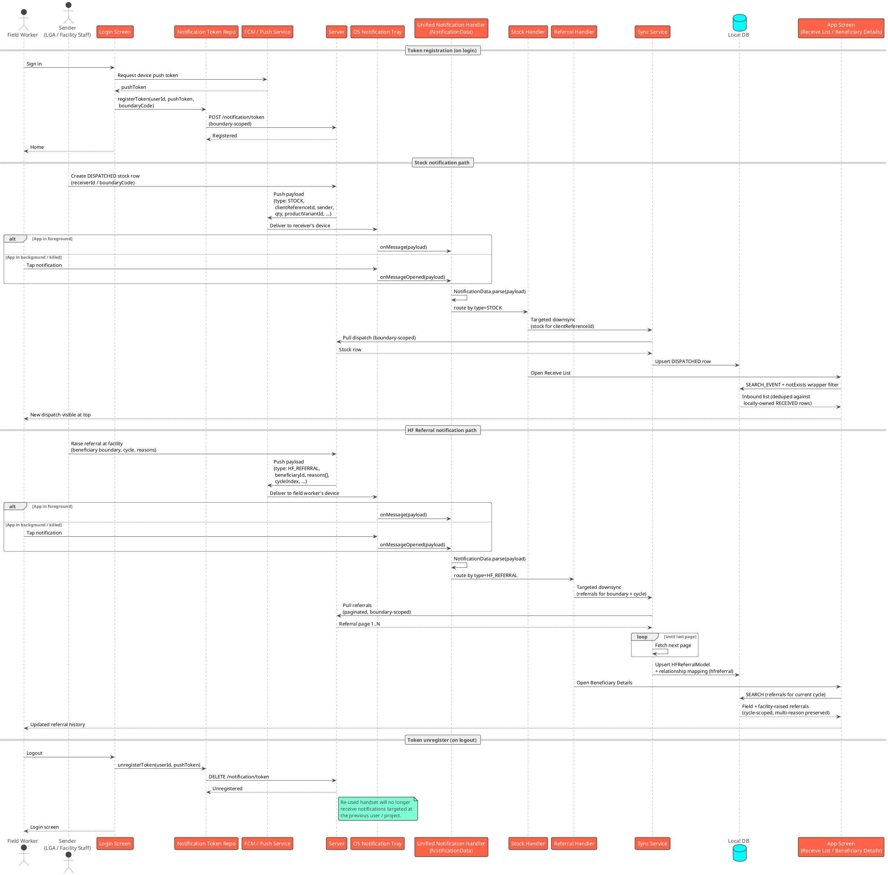

# HCM v2.1 — Release Notes

Features in HCM v2.1, alongside platform hardening (security/VAPT, MDMS v2, multi-hierarchy, search performance). This note focuses on what's new from a feature standpoint — what users and campaign teams can now do that they couldn't before.

---

## 1. Stock Revamp — Accept/Reject + CDD Scan-to-Receive

### What's new for users

- **Accept and Reject are now first-class actions.** When a facility or community distributor receives stock, they can explicitly **Accept** (which records the stock as received and acknowledges the inbound dispatch) or **Decline** (no stock is added, the sender is notified). Each side of the transaction has its own audit trail.
- **Scan-to-Receive for Community Distributors (CDDs).** A new role-gated **Scan** button lets CDDs receive stock by scanning a QR code presented at the LGA or warehouse. This unlocks the leaf-level distribution case where the CDD's device may be offline or hasn't yet synced the dispatch.
- **Smart QR at the LGA / Warehouse side.** The "View QR" popup on the dispatch card now encodes the full stock dispatch (product, quantity, batch, expiry, SKU, waybill, sender, receiver, comments) — so a single scan transfers the entire receipt context.
- **Confirmation screen with safety checks** before the CDD commits the receipt:
  - **Receiver match check** — blocks accidental scans of stock dispatched to another facility.
  - **Duplicate scan check** — blocks scanning the same dispatch twice.
- **Cleaner Receive list.** The incoming-transactions list automatically hides any dispatch the user has already received, even when the dispatch arrives via downsync *after* the user has already scanned and accepted it locally.
- **Campaign-scoped stock balance.** Balances are now tracked per campaign, so a worker who handles stock across multiple campaigns sees the right opening / closing numbers in each.

### Stock Receive Flow — UML Sequence Diagram

---

## 2. Registration & Delivery — HF Referral Downsync + New Campaign Support

### What's new for users

**New campaign types supported out of the box:**

- **SMC (Seasonal Malaria Chemoprevention)** — full MR-DN flow including cycle tracking, target/delivered counts, redose handling, and "unable to deliver" guards. Householders, members, and delivery actions are config-driven, so campaign teams can tune target ages, dose counts, and cycle length from the console.
- **Polio** — including inside-household monitoring, LQA (Lot Quality Assurance) data collection, and a configurable daily return cap for vials. Polio-specific stock details and unable-to-deliver behavior are included.
- **Bednet** — including child-count validation on the Add Member action so a bednet allocation can't be created against a household with no eligible recipients.

The default registration_delivery package now ships with these flows alongside the standard HCM flow, and a project is bound to its campaign type at runtime via per-project config.

**Registration / Delivery UX improvements:**

- **Smarter member display in householdOverview** — after adding a new member during SMC/Polio flows, the member appears immediately without requiring a re-entry.
- **Accurate computed values** — currentRunningCycle, deliveryLength, targetCycle, and currentDelivery are now resolved correctly across cycles.
- **Cleaner button & icon set** — Edit Household, Edit Individual, and Add Member icons unified across Polio and SMC; redose / unable-to-deliver guards added on ADMINISTERED_SUCCESS, NOT_VISITED tags and the Delivery button so users can't act on a state that has already been resolved.
- **Hidden-condition support in forms** — fields and groups can be hidden purely by config, simplifying campaign-specific tailoring.
- **Improved beneficiary search** — a new "no result" card guides the field worker when a search returns nothing, and search performance is materially better (see platform notes).
- **Localizations loaded on startup for every supported locale** — no more missing-key blanks when switching languages mid-flow.

#### v2.1 — Registration & Delivery (multi-campaign, config-driven)

### HF Referral — what's new

HF Referral downsync is now reliable — the single biggest improvement in the registration_delivery area for v2.1.

- **Beneficiary referral downsync** correctly pulls referrals raised at the facility back into the field-worker device, so a returning beneficiary's referral history is visible at the doorstep.
- **Multi-cycle HF Referral support** — re-entering a beneficiary into a new cycle now resolves the correct referral state instead of carrying forward stale data.
- **Notifications unified** — stock and referral notifications share a single notification handler; new referrals are surfaced to the relevant worker.
- **Referral reason logic** — referral reasons are read from navigation context and threaded into the symptoms field consistently. A default reason (`DRUG_SE_CC`) is applied when no symptom-derived reason is found, so a partially-completed referral is never blocked.
- **Multiple-reason cases** are handled correctly — a single referral can carry more than one reason without losing data.
- **Age handling** — HF referral age model corrected to use months (max 59) with a custom age function, fixing the prior age-mismatch behavior that caused referrals to be rejected.
- **Boundary module wired** for HF referral and complaint flows, enabling boundary-scoped referral searches and pickups.
- **Pagination** on HF referral lists now works correctly for high-volume facilities.
- **Referral metrics** updated to reflect the new model.

#### v2.1 — HF Referral (bidirectional, multi-cycle, boundary-scoped)

---

## 3. Attendance Revamp

### What's new for users

- **Signature capture & compare on Mark Attendance.** Field workers can now capture an individual's signature when marking attendance, and the screen also offers a **compare** view that places the existing signature on file side-by-side with the current capture for visual verification.
  - **Signature capture** widget renders inline on the attendance row (`MARK_ATTENDANCE_CAPTURE_SIGNATURE_LABEL`) with Clear / Confirm actions.
  - **Existing-signature lookup** reads the most recent signature for the individual from the attendance log so the worker has a reference to compare against.
  - **Compare signature dialog** shows the existing signature (reference), the new capture, and labels for present / absent / reference signatures so the worker can confirm a legitimate match before submitting.
  - **Per-individual storage** — signatures are stored as part of the attendance log against the `individualId`, grouped under a `signatureCollection` so they round-trip cleanly through draft / submit.
  - **Signature-required validation** — a register can be configured to require a signature before Submit is allowed (`MARK_ATTENDANCE_SIGNATURE_REQUIRED_LABEL`); the bloc enforces this via the present/absent submit check.
- **One consolidated attendance flow.** All attendance journeys (mark, draft, submit, view registers) are merged into a single config — easier to localize, easier to extend per-campaign, and consistent across the app.
- **Cleaner mark-attendance interaction.** Single-tap marks Present, double-tap marks Absent, and the present/absent toggle behaves correctly after marking absent (previously a sticky-state bug). A new "any selected" check gates Submit so a worker can't accidentally submit an empty register.
- **Better empty / edge states.** A "no result" card shows up cleanly when there are no registers; attendance registers render even when the individual ID is missing; face events show up in the attendance module as expected.
- **Session type captured.** Attendance logs now carry session type in additional details, enabling per-session reporting downstream.
- **QR generation hardened** — null-safety improvements so QR generation no longer crashes on partial register data.
- **Warehouse Manager role added** — warehouse managers can now access attendance, supporting the warehouse-level workforce check-in use case.
- **Manage Attendance card on Home is now config-driven** — no longer hardcoded, so it can be reordered, gated by role, or hidden per project from the console.

### Attendance — Flow Comparison

**What changed vs v2.0:**

- v2.0 had no signature capture step — attendance was a single tap (present) / double tap (absent) → submit.
- v2.0 routed through the package-level `attendance_bloc`; v2.1 the bloc lives in project code so signature capture and per-individual storage can be extended.
- v2.0 attendance log did not carry session type; v2.1 it does.
- v2.0 had no "any selected" gate on Submit; v2.1 enforces it.

#### v2.1 — Mark Attendance Flow (with signature capture & compare)

---

## 4. Notifications Integration

Push notifications are wired end-to-end in v2.1 for both Stock and HF Referral flows. A single notification handler now dispatches to the right flow based on payload type, with token registration on login and unregister on logout so a device only receives notifications relevant to the currently signed-in user / project.

### What's new across both flows

- **Notification token lifecycle.** The device's push token is registered against the user on login (via the new notification-token repository) and **unregistered on logout**, so a re-used handset doesn't keep receiving notifications meant for a previous user.
- **Unified payload handler.** A single `NotificationData` payload class parses incoming notifications and routes them — stock-related events go through the stock handler, referral-related events go through the referral handler. Adding a third flow in future is a payload-type addition, not a new pipeline.
- **Boundary-scoped delivery.** Notifications are scoped to the worker's assigned boundary, matching how stock and referral data are already scoped — workers only see events for their own LGA / facility / village.
- **Notification-triggered downsync.** Incoming notifications kick a targeted downsync for the related entity (stock dispatch or HF referral), so the worker sees the new record on next list refresh without waiting for the periodic sync.

### Notifications Flow — UML Sequence Diagram

---

### 4.1 Stock Notifications

When the warehouse manager / LGA dispatches stock toward a facility or team, the receiver-side user gets a push notification announcing the inbound transaction. The notification carries enough payload to trigger an immediate downsync of just that dispatch.

**What field workers see:**

- A push notification on the receiver's device the moment stock is dispatched their way ("New stock dispatch from <sender> — <quantity> <product>").
- Tapping the notification opens the receive list with the new inbound transaction already pulled and visible at the top.
- The receive list's dedup (via the wrapper-level `notExists` filter — see §1) correctly hides the inbound if the user has already received it via QR scan, so notifications can't cause a duplicate entry.

**What triggers it:**

- A new `DISPATCHED` stock row created by a sender that names the recipient (by `receiverId` or by `boundaryCode` for boundary-routed flows).
- Stock balance updates that flip a downstream worker's available quantity (informational notifications — opt-in via campaign config).

---

### 4.2 HF Referral Notifications

When a facility raises a referral against a beneficiary, the field worker assigned to that boundary gets a push notification so the referral history is current the next time the beneficiary is visited.

**What field workers see:**

- A push notification when a facility-side referral is created for a beneficiary in the worker's boundary ("New referral raised for <beneficiary> at <facility>").
- Tapping the notification opens the beneficiary's referral history, with the new facility-raised referral merged into the local list (via the HF Referral downsync described in §2).
- Pagination over high-volume referral lists works correctly — the notification-triggered downsync respects the same paged pull as the periodic downsync.

**What triggers it:**

- A new HF Referral created on the console / facility side that maps to the worker's assigned boundary.
- Multi-cycle re-entry: when a beneficiary is re-evaluated in a new cycle and a referral is raised, the worker is notified for the new cycle's referral specifically (no stale prior-cycle alerts).
- Referral notifications carry the referral's reason(s) so the worker has context before opening the record — multi-reason cases are preserved end-to-end (see §2 HF Referral changes).

---

## Cross-cutting platform improvements (context for testers)

- **Security / VAPT**: SSL pinning, root detection, secure broadcast receivers, ProGuard hardening, secure platform-usage mitigations.
- **MDMS v1 → v2** migration across the app.
- **Multi-hierarchy**: hierarchy is per-project at runtime (no longer build-time), fixing campaigns that span more than one hierarchy type.
- **Search & query**: new operators (`matches`, `within`, `equalsAny`, `containsAll`), null/empty hardening, table indexes, geo count via Drift — collectively a noticeable speed-up on search-heavy screens.
- **Auth**: logout now clears the auth token on the device.
- **Permissions UX**: single-button permission request, dynamic footer, navigation-to-Settings on dialog close, deduped toasts on multiple denials.
- **Boundary localizations** moved to post-login so users see a localized boundary tree from the first project-selection step.
