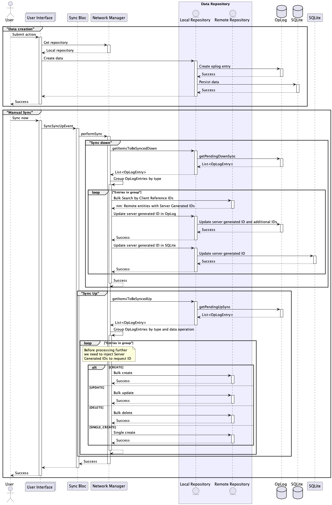

# Health Campaigns Field Worker App

[](https://github.com/invertase/melos)

This project is maintained using [Melos](https://melos.invertase.dev).

## Getting Started

### Pre-requisites

1. Flutter:
   The project is built using Flutter. The project uses the 3.16.5 [https://docs.flutter.dev/release/archive] version of Flutter. The path should
   contain `flutter`.
2. Dart
   `dart` should be available in the path and should use the same version as the bundled version that comes with Flutter

### Install Melos

```shell
dart pub global activate melos
```

### Clean Melos Installation

```shell
melos clean
```

### Bootstrap Melos

```shell
melos bootstrap
```

Running this scrip will bootstrap `melos`, which would generate melos build scripts, add `pubspec_overrides` and
generate build files.

---

## Install Mason and required bricks

This project uses [mason](https://pub.dev/packages/mason_cli) to generate the following

1. Serializable model classes
    * `[ClassName]EntityModel extends EntityModel`
    * `[ClassName]EntitySearchModel extends EntitySearchModel`
2. Remote repositories
3. Drift table configuration

To install mason, associated bricks and to generate the data models from config run the following script.

```shell
./tools/install_bricks.sh
```

## Mason Configuration

The `digit_entity` mason bricks require JSON configuration to work.

### Example

Digit entity config is defined in `individual.json`

```json
{
  "name": "individual",
  "createRepository": true,
  "attributes": [
    {
      "name": "id",
      "type": "String",
      "includeForQuery": true
    },
    {
      "name": "userId",
      "type": "String"
    },
    {
      "name": "dateOfBirth",
      "type": "String",
      "includeForQuery": true
    },
    {
      "name": "mobileNumber",
      "type": "String"
    },
    {
      "name": "altContactNumber",
      "type": "String"
    },
    {
      "name": "email",
      "type": "String"
    },
    {
      "name": "fatherName",
      "type": "String"
    },
    {
      "name": "husbandName",
      "type": "String"
    },
    {
      "name": "photo",
      "type": "String"
    }
  ],
  "customAttributes": [
    {
      "name": "name",
      "type": "name",
      "includeForQuery": true
    },
    {
      "name": "bloodGroup",
      "type": "bloodGroup",
      "isEnum": true
    },
    {
      "name": "address",
      "type": "address",
      "isList": true
    },
    {
      "name": "gender",
      "type": "gender",
      "isEnum": true,
      "includeForQuery": true
    },
    {
      "name": "identifiers",
      "type": "identifier",
      "isList": true,
      "includeForQuery": true
    }
  ],
  "isEnum": false
}
```

The following properties are significant

* `name` - Name of the entity, repository and table
* `entity-name` - A custom name
* `createRepository` - Whether this configuration requires a remote repository
* `isEnum` - Weather this is an Enum definition. Tables are not created for enums
* `attributes`: Used for defining native types
    * `name` - Name of the property
    * `type` - Data type [String, int, double, bool]
    * `includeForQuery` - Whether this attribute should be included in the `EntitySearchModel`
    * `includeForEntity` - Whether this attribute should be included for `EntityModel`
    * `includeForTable` - Whether this attribute should be included for tables
    * `isList` - Whether this attribute represents a List
    * `nullable` - is this attribute NNBD
* `customAttributes` - Used for defining non-native types
    * `name` - Name of the property
    * `type` - Data type (Also triggers an import for the same)
    * `includeForQuery` - Whether this attribute should be included in the `EntitySearchModel`
    * `includeForEntity` - Whether this attribute should be included for `EntityModel`
    * `includeForTable` - Whether this attribute should be included for tables
    * `isList` - Whether this attribute represents a List
    * `nullable` - is this attribute NNBD
    * `isEnum` - Whether this is an Enum parameter
* `dateTimeAttributes` - Used to define date time attributes
    * `name` - Name of the property
    * `type` - Must be DateTime
    * `nullable` - is this attribute NNBD

#### Output

1. Entity `lib/models/entities/individual.dart`

```dart
// Generated using mason. Do not modify by hand
import 'package:dart_mappable/dart_mappable.dart';
import 'package:drift/drift.dart';

import '../data_model.dart';
import '../../data/local_store/sql_store/sql_store.dart';

@MappableClass(ignoreNull: true)
class IndividualSearchModel extends EntitySearchModel {
  final String? id;
  final String? dateOfBirth;
  final List<String>? clientReferenceId;
  final String? tenantId;
  final NameSearchModel? name;
  final Gender? gender;
  final List<IdentifierSearchModel>? identifiers;

  IndividualSearchModel({
    this.id,
    this.dateOfBirth,
    this.clientReferenceId,
    this.tenantId,
    this.name,
    this.gender,
    this.identifiers,
    super.boundaryCode,
    super.isDeleted,
  }) : super();

  @MappableConstructor()
  IndividualSearchModel.ignoreDeleted({
    this.id,
    this.dateOfBirth,
    this.clientReferenceId,
    this.tenantId,
    this.name,
    this.gender,
    this.identifiers,
    super.boundaryCode,
  }) : super(isDeleted: false);
}

@MappableClass(ignoreNull: true)
class IndividualModel extends EntityModel {

  static const schemaName = 'Individual';

  final String? id;
  final String? userId;
  final String? dateOfBirth;
  final String? mobileNumber;
  final String? altContactNumber;
  final String? email;
  final String? fatherName;
  final String? husbandName;
  final String? photo;
  final String clientReferenceId;
  final String? tenantId;
  final int? rowVersion;
  final NameModel? name;
  final BloodGroup? bloodGroup;
  final List<AddressModel>? address;
  final Gender? gender;
  final List<IdentifierModel>? identifiers;
  final IndividualAdditionalFields? additionalFields;

  IndividualModel({
    this.additionalFields,
    this.id,
    this.userId,
    this.dateOfBirth,
    this.mobileNumber,
    this.altContactNumber,
    this.email,
    this.fatherName,
    this.husbandName,
    this.photo,
    required this.clientReferenceId,
    this.tenantId,
    this.rowVersion,
    this.name,
    this.bloodGroup,
    this.address,
    this.gender,
    this.identifiers,
    super.auditDetails,
    super.isDeleted = false,
  }) : super();

  IndividualCompanion get companion {
    return IndividualCompanion(
      auditCreatedBy: Value(auditDetails?.createdBy),
      auditCreatedTime: Value(auditDetails?.createdTime),
      auditModifiedBy: Value(auditDetails?.lastModifiedBy),
      auditModifiedTime: Value(auditDetails?.lastModifiedTime),
      additionalFields: Value(additionalFields?.toJson()),
      isDeleted: Value(isDeleted),
      id: Value(id),
      userId: Value(userId),
      dateOfBirth: Value(dateOfBirth),
      mobileNumber: Value(mobileNumber),
      altContactNumber: Value(altContactNumber),
      email: Value(email),
      fatherName: Value(fatherName),
      husbandName: Value(husbandName),
      photo: Value(photo),
      clientReferenceId: Value(clientReferenceId),
      tenantId: Value(tenantId),
      rowVersion: Value(rowVersion),
      bloodGroup: Value(bloodGroup),
      gender: Value(gender),
    );
  }
}

@MappableClass(ignoreNull: true)
class IndividualAdditionalFields extends AdditionalFields {
  IndividualAdditionalFields({
    super.schema = 'Individual',
    required super.version,
    super.fields,
  });
}
```

2. Table `lib/data/local_store/sql_store/tables/individual.dart`

```dart
// Generated using mason. Do not modify by hand

import 'package:drift/drift.dart';

import '../../../../models/entities/blood_group.dart';
import '../../../../models/entities/gender.dart';

class Individual extends Table {
  TextColumn get id => text().nullable()();

  TextColumn get userId => text().nullable()();

  TextColumn get dateOfBirth => text().nullable()();

  TextColumn get mobileNumber => text().nullable()();

  TextColumn get altContactNumber => text().nullable()();

  TextColumn get email => text().nullable()();

  TextColumn get fatherName => text().nullable()();

  TextColumn get husbandName => text().nullable()();

  TextColumn get photo => text().nullable()();

  TextColumn get auditCreatedBy => text().nullable()();

  IntColumn get auditCreatedTime => integer().nullable()();

  TextColumn get auditModifiedBy => text().nullable()();

  IntColumn get auditModifiedTime => integer().nullable()();

  TextColumn get clientReferenceId => text()();

  TextColumn get tenantId => text().nullable()();

  BoolColumn get isDeleted => boolean().nullable().withDefault(const Constant(false))();

  IntColumn get rowVersion => integer().nullable()();

  IntColumn get bloodGroup => intEnum<BloodGroup>().nullable()();

  IntColumn get gender => intEnum<Gender>().nullable()();

  TextColumn get additionalFields => text().nullable()();

  @override
  Set<Column> get primaryKey => { auditCreatedBy, clientReferenceId,};
}
```

3. Repository `lib/data/repositories/remote/individual.dart`

```dart
// Generated using mason. Do not modify by hand

import '../../../models/data_model.dart';
import '../../data_repository.dart';

class IndividualRemoteRepository extends RemoteRepository<IndividualModel, IndividualSearchModel> {
  IndividualRemoteRepository(super.dio, {
    required super.actionMap,
    super.entityName = 'Individual',
  });

  @override
  DataModelType get type => DataModelType.individual;
}
```

### Further customization

The `digit_entity` templates can be further customized by modifying the bricks and/or altering the `pre_gen`
or `post_gen` scripts.

The `pre_gen.dart` file contains transformation code that take the entity configuration and transform it
to `ConfigModel`, `AttributModel`, `TableReferenceModel`, and `EnumValues` all of which are defined
within `hooks/lib/models.dart`.

The `ConfigModel` is finally passed to the following `__brick__` configuration

* `mason_templates/digit_entity/__brick__/models/entities/{{name.snakeCase()}}.dart`
* `mason_templates/digit_entity/__brick__/data/repositories/remote/{{name.snakeCase()}}.dart`
* `mason_templates/digit_entity/__brick__/data/local_store/sql_store/tables/{{name.snakeCase()}}.dart`

---

## Firebase configuration

The project uses firebase for offline crash reporting. The firebase configuration is managed by flutterfire CLI tools.

### Setup

1. Install firebase CLI. Online instructions can be found [here](https://firebase.google.com/docs/cli#setup_update_cli)

```shell
curl -sL https://firebase.tools | bash
```

2. Login

```shell
firebase login
```

3. Install Flutterfire CLI

```shell
dart pub global activate flutterfire_cli
```

### Add firebase to app

To add firebase to an existing flutter application, `cd` into the app directory and run

```shell
flutterfire configure
```

This will start you on a guided process to select project, installation targets, etc. Once done, it will create the
following files.

1. `android/app/google_services.json`
2. `ios/Runner/GoogleService-info.plist`
3. `lib/firebase_options.dart`

These files contain configuration information that link the flutter app with firebase. Common firebase configuration
needs to be carried out in `packages/digit_firebase_configuration`.

#### Configuration

Crashlytics is configured inside `lib/digit_firebase_services.dart#initialize` function. This function initializes the
Firebase project. No Firebase libraries should be accessed before `initialize`  is called. The function should assign
error handlers to `FlutterError.onError` and `PlatformDispatcher.instance.onError`. Any uncaught exception will bubble
upto this point and will trigger a Crash event which will be cached by Crashlytics until network is available.

```dart
Future initialize({
  required FirebaseOptions options,
  ValueChanged<String>? onErrorMessage,
}) async {
  await Firebase.initializeApp(options: options);

  FlutterError.onError = (errorDetails) {
    onErrorMessage?.call(
      'Diagnostic node: '
          '${errorDetails.summary.name.toString()}',
    );
    FirebaseCrashlytics.instance.recordFlutterFatalError(errorDetails);
  };

  PlatformDispatcher.instance.onError = (error, stack) {
    onErrorMessage?.call(error.toString());
    FirebaseCrashlytics.instance.recordError(error, stack, fatal: true);
    return true;
  };
}
```

#### MDMS Configuration

The firebase project can be activated or deactivated based on MDMS configuration. The configuration is managed in

##### app_configuration.dart

```dart
@Collection()
class AppConfiguration {
  // 
  //
  @Name('FIREBASE_CONFIG')
  FirebaseConfig? firebaseConfig;
}

@embedded
class FirebaseConfig {
  bool? enableCrashlytics;
  bool? enableAnalytics;
}
```

#### main.dart

```dart
void main() {
  if (enableCrashlytics) {
    firebase_services.initialize(
      options: DefaultFirebaseOptions.currentPlatform,
      onErrorMessage: (value) {
        AppLogger.instance.error(title: 'CRASHLYTICS', message: value);
      },
    );
  }
}
```

## Showcase Configuration

Showcase is configured using [showcaseview](https://pub.dev/packages/showcaseview). A fork is created
at `packages/digit_showcase` to handle customizations.

### Configuration steps

#### Add i18n strings

Add constants to `lib/utils/i18_key_constants.dart`

```dart

const checklistDataShowcase = ChecklistDataShowcase();

class ChecklistDataShowcase {
  const ChecklistDataShowcase();

  String get date {
    return 'CHECKLIST_DATA_SHOWCASE_DATE';
  }

  String get administrativeUnit {
    return 'CHECKLIST_DATA_SHOWCASE_ADMINISTRATIVE_UNIT';
  }
}
```

#### Add Showcase configuration

##### Add `part` file

`checklist_data.dart`

```dart
part of 'showcase_constants.dart';

class _ChecklistDataShowcaseData {
  static final _ChecklistDataShowcaseData _instance =
  _ChecklistDataShowcaseData._();

  _ChecklistDataShowcaseData._();

  factory _ChecklistDataShowcaseData() => _instance;

  List<ShowcaseItemBuilder> get showcaseData =>
      [
        date,
        administrativeUnit,
      ];

  final date = ShowcaseItemBuilder(
    messageLocalizationKey: i18.checklistDataShowcase.date,
  );

  final administrativeUnit = ShowcaseItemBuilder(
    messageLocalizationKey: i18.checklistDataShowcase.administrativeUnit,
  );
}
```

##### Export as global variable

`showcase_constants.dart`

```dart
import '../../../utils/i18_key_constants.dart' as i18;
import '../showcase_wrappers.dart';

part 'survey_form_data.dart';

final checklistDataShowcaseData = _ChecklistDataShowcaseData();
```

#### Activate showcase on route navigation

`showcase_button.dart`

```dart
import 'package:digit_showcase/showcase_widget.dart';
import 'package:flutter/material.dart';

import '../../router/app_router.dart';
import '../../utils/i18_key_constants.dart' as i18;
import '../localized.dart';
import 'config/showcase_constants.dart';

class ShowcaseButton extends LocalizedStatefulWidget {
  final Iterable<GlobalKey>? showcaseFor;

  const ShowcaseButton({super.key, this.showcaseFor});

  @override
  LocalizedState<ShowcaseButton> createState() => _ShowcaseButtonState();
}

class _ShowcaseButtonState extends LocalizedState<ShowcaseButton> {
  @override
  Widget build(BuildContext context) {
    return TextButton(
      onPressed: () {
        if (widget.showcaseFor?.isNotEmpty == true) {
          ShowcaseWidget.of(context).startShowCase(
            widget.showcaseFor!.toList(),
          );

          return;
        }

        final current = context.router.current.name;
        final paths = _showcasePathsForRoute(current);

        if (paths == null) return;
        if (paths.isEmpty) return;

        ShowcaseWidget.of(context).startShowCase(paths.toList());
      },
      child: Row(
        children: [
          Text(localizations.translate(i18.common.coreCommonHelp)),
          const Icon(Icons.help_outline),
        ],
      ),
    );
  }

  Iterable<GlobalKey>? _showcasePathsForRoute(String routeName) {
    return switch (routeName) {
    // Add this config
      ChecklistBoundaryViewRoute.name =>
          checklistDataShowcaseData.showcaseData.map((e) => e.showcaseKey),
      _ => null,
    };
  }
}
```

#### Wrap target widget with showcase wrapper which acts as a HoC

```dart
class _ChecklistBoundaryViewPageState extends LocalizedState<ChecklistBoundaryViewPage> {
  @override
  Widget build(BuildContext context) {
    final theme = Theme.of(context);

    return Scaffold(
      body: ScrollableContent(
        header: const Column(children: [
          BackNavigationHelpHeaderWidget(
            // Add showcase button
            showcaseButton: ShowcaseButton(),
          ),
        ]),
        footer: DigitCard(
          child: DigitElevatedButton(
            onPressed: () => context.router.push(ChecklistViewRoute()),
            child: Text(localizations.translate(
              i18.common.coreCommonContinue,
            )),
          ),
        ),
        slivers: [
          SliverToBoxAdapter(
            child: DigitCard(
              child: Column(
                crossAxisAlignment: CrossAxisAlignment.start,
                mainAxisSize: MainAxisSize.min,
                children: [
                  Text(
                    localizations.translate(
                      i18.checklist.checklistDetailLabel,
                    ),
                    style: theme.textTheme.displayMedium,
                  ),
                  // Wrap with showcase wrapper
                  checklistDataShowcaseData.date.buildWith(
                    child: DigitTextField(
                      readOnly: true,
                      label: localizations.translate(
                        i18.checklist.checklistdate,
                      ),
                      suffixIcon: const Padding(
                        padding: EdgeInsets.all(8),
                        child: Icon(
                          Icons.date_range_outlined,
                        ),
                      ),
                      controller: TextEditingController(
                        text: DateFormat('dd MMMM yyyy').format(DateTime.now()),
                      ),
                    ),
                  ),
                ],
              ),
            ),
          ),
        ],
      ),
    );
  }
}
```

## Data Sync

Currently, the app is configured to run only on `PersistenceConfiguration.offlineFirst` mode. With the offline first
approach the local data store is considered as the **Source of truth**. Data persisted in the local data store is synced
to the remote data store.



### Data Creation

The following steps describe the data creation process:

1. The user initiates the data creation by performing a Submit action.
2. The UI receives the action and requests the repository from the Network Manager.
3. The Network Manager returns the Local repository.
4. The UI creates the data and stores it in the Local repository.
5. The Local repository creates an entry in the OpLog.
6. Success is returned to the UI.
7. The Local repository persists the data in the SQLite database.
8. Success is returned to the UI.

### Manual Sync

The following steps describe the manual synchronization process:

1. The user initiates the manual sync by selecting the Sync now option.
2. The UI sends a SyncSyncUpEvent to the Sync Bloc.
3. The Sync Bloc performs the sync operation.
4. The Network Manager retrieves the items to be synced down from the Local repository.
5. The Local repository queries the OpLog for pending down sync operations and returns a list of OpLog entries.
6. The network manager groups the OpLog entries by type.
7. For each entry group:
    - The network manager sends a Bulk Search request to the Remote repository using the Client Reference IDs.
    - The Remote repository returns the remote entities with Server Generated IDs.
    - The network manager updates the server-generated ID in the OpLog and returns success.
    - The network manager updates the server-generated ID in the SQLite database and returns success.
8. Success is returned to complete the sync down process.

9. The network manager retrieves the items to be synced up from the Local repository.
10. The Local repository queries the OpLog for pending up sync operations and returns a list of OpLog entries.
11. The network manager groups the OpLog entries by type and data operation.
12. For each entry group:
    - If it is a CREATE operation:
        - The network manager sends a Bulk create request to the Remote repository and returns success.
    - If it is an UPDATE operation:
        - The network manager sends a Bulk update request to the Remote repository and returns success.
    - If it is a DELETE operation:
        - The network manager sends a Bulk delete request to the Remote repository and returns success.
    - If it is a SINGLE_CREATE operation:
        - The network manager sends a Single create request to the Remote repository and returns success.
13. Success is returned to complete the sync up process.
