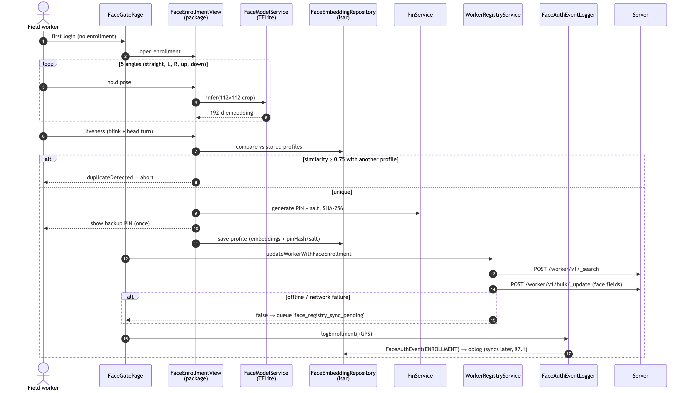
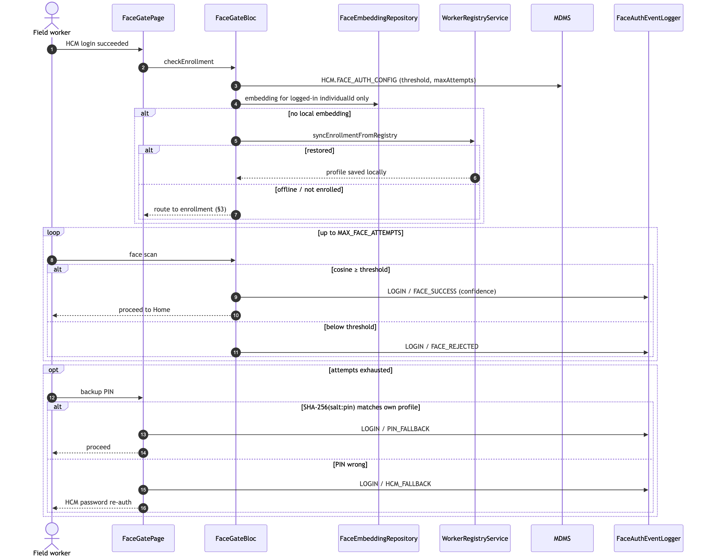
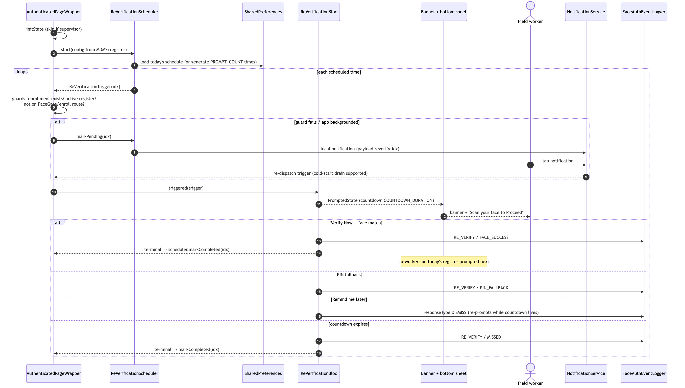
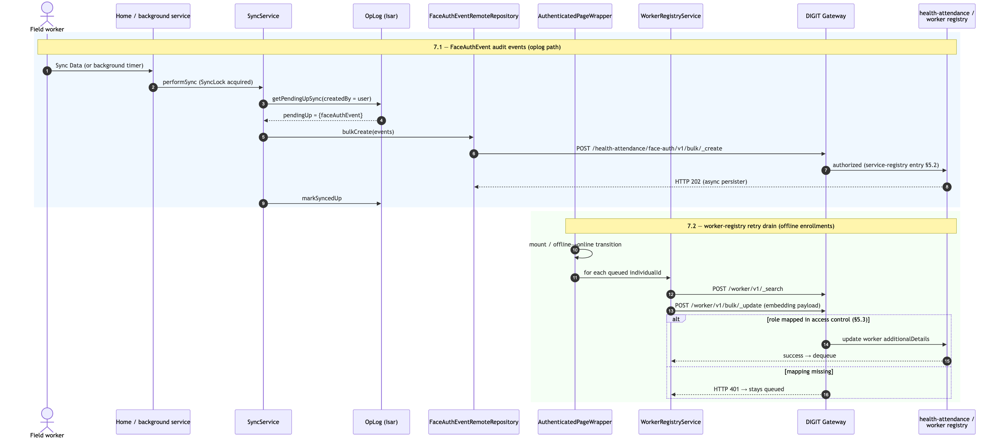

# Face Recognition — Technical Documentation

**Feature branch:** `face-recognition` (ported from `mc-bednet/feat/face-auth`)
**Last updated:** 2026-07-21

Offline-first facial recognition for HCM field workers. Provides identity
verification at login, periodic re-verification during the workday,
co-worker (non-mobile user) enrollment/verification on a supervisor's
device, and a PIN fallback — all functional without connectivity, with
audit events and enrollment data syncing to the server when online.

---

## 1. High-Level Architecture

```
┌───────────────────────────────────────────────────────────────────┐
│ App (health_campaign_field_worker_app)                            │
│                                                                   │
│  Pages: FaceGatePage · PinFallbackPage · FaceAuthHistoryPage      │
│         NonMobileUserListPage · NonMobileFaceEnrollPage           │
│  Widgets: ReVerificationListener · reverification popup/sheet     │
│         countdown banner · FaceVerificationDialog                 │
│  Blocs: FaceGateBloc · ReVerificationBloc                         │
│  Services: ReVerificationScheduler · FaceAuthEventLogger          │
│         WorkerRegistryService · NotificationService               │
│         FaceDataCleanupService                                    │
├───────────────────────────────────────────────────────────────────┤
│ Package: digit_face_verification                                  │
│                                                                   │
│  Views: FaceEnrollmentView · FaceVerificationView                 │
│         FaceCaptureView · LivenessChallengeView · CustomPinPad    │
│  Blocs: FaceEnrollmentBloc · FaceVerificationBloc · LivenessBloc  │
│  Data:  FaceModelService (TFLite) · LivenessDetectionService      │
│         FaceEmbeddingRepository (Isar) · PinService               │
│  Assets: mobilefacenet.tflite · audio cues (add.wav, buzzer.wav)  │
├───────────────────────────────────────────────────────────────────┤
│ Shared: digit_data_model (FaceAuthEventModel, oplog)              │
│         transit_post (FaceAuthEvent local/remote/oplog repos)     │
│         sync_service (SyncService, SyncLock)                      │
└───────────────────────────────────────────────────────────────────┘
```

The **package** is self-contained ML + UI. The **app layer** owns
policy: when to gate, when to prompt, what to log, how to sync.

---

## 2. ML Pipeline

| Item | Value |
|---|---|
| Model | MobileFaceNet (TFLite), bundled at `packages/digit_face_verification/assets/models/mobilefacenet.tflite` |
| Input | 112 × 112 × 3 cropped face (JPEG-encoded crop retained for audit) |
| Output | 192-dimension embedding vector |
| Similarity metric | Cosine similarity (`utils/distance_metrics.dart`) |
| Match threshold | Default **0.70**; overridable from MDMS (`FACE_MATCH_THRESHOLD`, currently 0.75 on demo) |
| Duplicate-enrollment threshold | **0.75** — a new enrollment whose embedding matches an existing profile above this is rejected (`FaceEnrollmentBloc.duplicateThreshold`) |

Face detection/landmarks come from ML Kit via the camera stream in
`FaceCaptureView`; lighting quality is assessed
(`lighting_assessment.dart`) before capture.

### Liveness detection

`LivenessDetectionService` requires active challenges before an
enrollment is accepted: **blink** (eye-open probability crossing
0.7 → 0.3 → 0.7) and **head turn** (left/right). Verification flows use
the same service via `LivenessChallengeView`.

---

## 3. Enrollment

Entry points:

- **System user (distributor)** — `FaceGatePage` routes to
  `FaceEnrollmentView` on first login after authentication
  (`HomePage._checkFaceEnrollment` → `FaceGateRoute`).
- **Co-worker (non-mobile user)** — sidebar → *Non mobile users* →
  `NonMobileFaceEnrollPage`, performed on the supervisor/distributor
  device.

Flow (`FaceEnrollmentView`):

1. Intro screen (steps + logout escape hatch).
2. Capture **5 angles**: straight, left, right, up, down.
3. **Liveness challenge** pass.
4. Duplicate check against all locally stored profiles (≥ 0.75 → rejected
   with `duplicateDetected`; device cap reached → `maxUsersReached`).
5. A **backup PIN** is generated and shown once. Only
   `SHA-256(salt:pin)` + a 16-byte random salt are stored
   (`PinService`) — the PIN itself is never persisted.
6. Profile persisted locally (see §6) and pushed to the **worker
   registry** (see §7.2). GPS is captured for the enrollment audit event.
7. `FaceAuthEventLogger.logEnrollment` writes an `ENROLLMENT` audit
   event into the sync pipeline (see §7.1).

### Sequence — system-user enrollment



*Diagram source: [`diagrams/enrollment-sequence.mmd`](diagrams/enrollment-sequence.mmd)*

---

## 4. Verification Flows

### 4.1 Login gate (`FaceGatePage` + `FaceGateBloc`)

After HCM login, the gate matches the camera face **only against the
logged-in user's own embedding** (never all profiles — a co-worker's
face or PIN must not unlock another user's session). Outcomes:

- Face match ≥ threshold → proceed (`LOGIN / FACE_SUCCESS` event).
- Max attempts (MDMS `MAX_FACE_ATTEMPTS`, default 3) → PIN fallback
  (`PIN_FALLBACK`) → HCM-password fallback (`HCM_FALLBACK`).
- If the local embedding is missing (fresh install), the bloc attempts
  `WorkerRegistryService.syncEnrollmentFromRegistry` to restore the
  enrollment from the server; fails open to enrollment when offline.

### Sequence — login gate



*Diagram source: [`diagrams/login-gate-sequence.mmd`](diagrams/login-gate-sequence.mmd)*

### 4.2 Periodic re-verification

Wired in `AuthenticatedPageWrapper` (`lib/pages/authenticated.dart`):

- **`ReVerificationScheduler`** generates `PROMPT_COUNT` random prompt
  times inside `START_HOUR`–`END_HOUR`, at least `MIN_GAP_MINUTES`
  apart. The day's schedule is **persisted in SharedPreferences** and
  reused for the rest of the day (a same-day MDMS timing change only
  takes effect after a config-change restart or the next day).
- On trigger: countdown banner (`_ReVerificationCountdownBanner`) +
  bottom sheet (*Verify Now / Remind Me Later*) with a
  `COUNTDOWN_DURATION_MINUTES` timer, and an "Attempt X of Y" AppBar
  counter. Expiry logs `MISSED`.
- Triggers are deferred (`markPending`) while no enrollment exists, on
  the FaceGate/enrollment routes, or when the app is backgrounded — a
  local **notification** fires instead; tapping it (even cold-start)
  re-dispatches the trigger (`_checkNotificationLaunch`, pending-tap
  drain).
- **Supervisors are exempt** (`TEAM_SUPERVISOR`, `DISTRICT_SUPERVISOR`
  roles → `face_reverify_skip`).
- Attendance-register `additionalDetails.startHour/endHour` override
  the MDMS window when an active register exists for today.
- App resume calls `scheduler.checkNow()` to catch missed windows.

### Sequence — periodic re-verification



*Diagram source: [`diagrams/reverification-sequence.mmd`](diagrams/reverification-sequence.mmd)*

### 4.3 Co-worker verification

When the system user verifies, pending co-workers on today's
attendance register are prompted next (`coWorkerPendingNotifier`,
"System user must verify their face first before co-workers can
proceed"). Co-worker embeddings are **prefetched from the worker
registry** after login (`_prefetchCoWorkerEmbeddings`) so verification
works offline later. Events are logged with the co-worker's
`individualId` and the subject name in `additionalFields`.

---

## 5. Server Configuration (MDMS, tenant-scoped)

### 5.1 `HCM.FACE_AUTH_CONFIG`

Fetched **live** (never cached) by `MdmsRepository.searchFaceAuthConfig`
each time the authenticated wrapper mounts (login / app start):

| Key | Default (client) | Purpose |
|---|---|---|
| `START_HOUR` / `END_HOUR` | 8 / 18 | Re-verification window |
| `PROMPT_COUNT` | 3 | Prompts per day |
| `MIN_GAP_MINUTES` | 180 | Minimum spacing between prompts |
| `COUNTDOWN_DURATION_MINUTES` | 5 | Response window per prompt |
| `MAX_FACE_ATTEMPTS` | 3 | Attempts before PIN fallback |
| `FACE_MATCH_THRESHOLD` | 0.70 | Cosine-similarity cutoff |

### 5.2 Service registry (`HCM-SERVICE-REGISTRY.serviceRegistry`)

Required entry (present on demo under `AttendanceService`):

```json
{ "actions": [
  { "path": "/health-attendance/face-auth/v1/_create",      "action": "create",     "entityName": "FaceAuthEvent" },
  { "path": "/health-attendance/face-auth/v1/bulk/_create", "action": "bulkCreate", "entityName": "FaceAuthEvent" },
  { "path": "/health-attendance/face-auth/v1/_search",      "action": "search",     "entityName": "FaceAuthEvent" }
]}
```

`entityName` must be exactly `FaceAuthEvent` (matched by camelCase
against `DataModelType.faceAuthEvent`). The app refreshes its cached
registry when the MDMS **module-version** changes; without that bump a
device keeps its first-install registry.

### 5.3 Access control (`ACCESSCONTROL-ACTIONS-TEST` / role-actions)

The DIGIT gateway 401s any URI not mapped to the caller's roles. The
worker-registry endpoints must be mapped for enrolling roles
(e.g. `DISTRIBUTOR`):

- `/worker/v1/_search` — present on demo (action id 4124).
- `/worker/v1/bulk/_update` — **must also be mapped**; without it the
  embedding push fails with HTTP 401 and stays queued (known gap on
  demo as of 2026-07-20).

---

## 6. Local Data Model & Storage

| Store | Contents |
|---|---|
| **Isar** (`FaceEmbeddingRepository`) | Per-individual profile: primary embedding, per-angle embeddings (flattened, `angleCount` × 192), model version, `isSystemUser`, `enrolledBy`, enrollment profile (PIN hash + salt, `enrolledAt`, `supervisorApprovalStatus`, `twinFlagged`) |
| **Encrypted SQLCipher DB** (`LocalSqlDataStore`) | `FaceAuthEvent` rows + oplog entries for sync |
| **FlutterSecureStorage** | Session/user data, `isFaceEnrollmentComplete`, `userIndividualId`, DB encryption key, `SyncLock` |
| **SharedPreferences** | Day schedule + completed prompt indices, `face_reverify_skip`, pending worker-registry queues (`face_registry_sync_pending`, `face_registry_sync_pending_ids`), notification bookkeeping |

### `FaceAuthEventModel` (audit event)

`clientReferenceId` (UUID), `individualId` (subject), `eventType`
(`LOGIN | CHECK_IN | RE_VERIFY | ENROLLMENT`), `outcome`
(`FACE_SUCCESS | FACE_REJECTED | PIN_FALLBACK | HCM_FALLBACK | MISSED`),
`confidence`, `latitude/longitude/locationAccuracy`, `timestamp`,
`failedAttemptCount`, `fallbackReason`, `popupTime/responseTime/responseType`
(`FACE | PIN | DISMISS | TIMEOUT | ATTEMPT`), `anomalyFlags`,
`faceImage` (base64 112×112 crop, optional), `projectId`, `tenantId`,
audit details (`createdBy` = system-user UUID — required for oplog
pickup). App-only fields (`isSync`, `deviceId`, `boundaryCode`,
`syncTimestamp`) travel in `additionalFields`.

---

## 7. Sync Architecture

### 7.1 FaceAuthEvent audit events (oplog → sync service)

Standard HCM offline-first path: local create writes the row + an oplog
entry; `SyncService.performSync` (manual **Sync Data** button, and the
background service) bulk-uploads via
`FaceAuthEventRemoteRepository.bulkCreate` →
`POST /health-attendance/face-auth/v1/bulk/_create` (HTTP 202 =
accepted by the async persister). Wired in:

- `Constants.getLocalRepositories / getRemoteRepositories` (background isolate)
- `NetworkManagerProviderWrapper` (UI providers)
- `attemptSyncUp` (`utils.dart`) — manual sync repo lists
- `EntityMapper` (`sync_service_mapper.dart`) — sync count / response mapping

> A pending oplog type with **no** matching remote repository throws
> `Remote repository is not passed to sync service` and blocks the whole
> sync — this is what a missing/stale service-registry entry looks like.

### 7.2 Worker registry (enrollment data)

Direct calls (not oplog-based), `WorkerRegistryService`:

- **Push** after enrollment: `_search` worker by `individualId`, then
  `POST /worker/v1/bulk/_update` with face fields in
  `additionalDetails.fields` (embedding, angle embeddings, model
  version, PIN hash+salt, enrolledBy, approval status…).
- **Pull**: `syncEnrollmentFromRegistry` restores a profile from the
  server (login-gate restore; co-worker prefetch).
- **Offline queues**: a failed push leaves the ID queued —
  `face_registry_sync_pending` (self-enrollment, FaceGatePage) and
  `face_registry_sync_pending_ids` (co-workers). Drained by
  `_retryPendingWorkerRegistrySync` in `AuthenticatedPageWrapper` on
  mount and on every offline→online transition.
  `updateWorkerWithFaceEnrollment` returns `true` for success *or*
  terminal states (dequeue), `false` only for retryable network
  failures.

### Sequence — data sync (audit events + worker registry)



*Diagram source: [`diagrams/sync-sequence.mmd`](diagrams/sync-sequence.mmd)*

---

## 8. Localization

All UI codes are `FACE_AUTH_*` (153 codes) under module **`hcm-common`**
for every locale (`en_DEMO`, `pt_DEMO`, `fr_DEMO` on demo).
`hcm-common` is in `Constants.initialLocalizationModules`, so codes are
cached at boot for the selected locale.

The package's `FaceVerificationLocalization.translate` resolves from its
own delegate rows first, then falls back to the **app-level
`AppLocalizations` resolver** via the static `appTranslate` hook (set in
`getAppLocalizationDelegates`) — this keeps package screens localized
even when the package delegate's one-shot row snapshot is stale.

---

## 9. Security & Privacy

- Raw face images are **not** stored as a gallery; only the 112×112
  crop optionally rides along on audit events (`faceImage`) for review.
- Embeddings are one-way features; the model never reconstructs faces.
- PIN: salted SHA-256 only; shown once at enrollment.
- Event rows live in the SQLCipher-encrypted DB; keys in secure storage.
- Login gate matches strictly against the logged-in user's profile —
  co-worker embeddings on the same device cannot unlock a session.
- SSL pinning enforced by `DioClient`; bad certificates always rejected.
- `FaceDataCleanupService` handles local face-data removal (logout /
  user-switch hygiene).

---

## 10. Troubleshooting

| Symptom | Likely cause | Fix |
|---|---|---|
| Sync fails: `Remote repository is not passed to sync service`, `pendingUp={faceAuthEvent}` | Device's cached service registry predates the `FaceAuthEvent` entry | Bump MDMS module-version (or clear app data) so the registry refetches |
| Embedding push logs `NETWORK FAILURE … 401` | `/worker/v1/bulk/_update` not mapped in access control for the user's role | Add the action + role-action mapping in MDMS; queued pushes drain automatically |
| Face screens show raw `FACE_AUTH_*` codes | Locale rows missing on server for the selected locale, or app-level fallback not wired | Verify codes exist under `hcm-common` for the locale; `appTranslate` hook set in `getAppLocalizationDelegates` |
| Re-verification popup never appears | Scheduler not wired (must be started from `AuthenticatedPageWrapper.initState`); or supervisor role; or outside `START_HOUR`–`END_HOUR` | Check `ReVerificationScheduler:` debug logs; verify role and window |
| Same-day MDMS timing change has no effect | Day schedule persisted in SharedPreferences is reused | Wait for next day, clear app data, or delete the schedule prefs keys |
| Sync button silently does nothing | A repository provider lookup threw before the bloc event was added | Check for `ProviderNotFoundException` in logs; ensure registry entry exists so conditional providers register |

Useful log tags: `FaceGateBloc:`, `FaceAuthEventLogger:`,
`FaceAuthEventRemote.*`, `[FaceRegistrySync]`, `[FaceRegistryPush]`,
`ReVerificationScheduler:`, `SyncService:`, `BG_SYNC:`,
`FaceAuthEventOpLog:`.

---

## 11. Key Files

```
packages/digit_face_verification/
  lib/data/face_model_service.dart          # TFLite inference (112×112 → 192-d)
  lib/data/liveness_detection_service.dart  # blink + head-turn challenges
  lib/data/face_embedding_repository.dart   # Isar profile store
  lib/data/pin_service.dart                 # salted SHA-256 PIN
  lib/blocs/…                               # enrollment / verification / liveness
  lib/widgets/…                             # capture, enrollment, verification, pin pad
  lib/blocs/app_localization.dart           # package i18n + appTranslate hook

packages/transit_post/lib/data/repositories/{local,remote,oplog}/face_auth_event*.dart
packages/digit_data_model/lib/models/entities/face_auth_event.dart

apps/health_campaign_field_worker_app/lib/
  pages/authenticated.dart                  # scheduler wiring, banner, prefetch, retry drain
  pages/face_gate.dart                      # login gate + registry push
  pages/pin_fallback.dart
  pages/face_auth_history.dart
  pages/non_mobile_user/…                   # co-worker list + enrollment
  blocs/face_auth/…                         # FaceGateBloc, ReVerificationBloc
  services/reverification_scheduler.dart
  services/face_auth_event_logger.dart
  services/worker_registry_service.dart
  services/face_auth_config.dart            # config model + MDMS mapping
  widgets/face_auth/…                       # popup, dialog, overlay, session card
```
