# HCM Field Worker App — Database ER Diagram

> Generated from Drift table definitions in `packages/digit_data_model/lib/data/local_store/sql_store/tables/`
>
> **Note:** SQLite / Drift does not enforce foreign key constraints at the DB level.
> Relationships are by convention using `clientReferenceId` / `id` reference columns.
> Most tables use a composite PK of `(auditCreatedBy, clientReferenceId)`.

```mermaid
erDiagram

    %% ══════════════════════════════════════════════════════
    %% CORE BENEFICIARY DOMAIN
    %% ══════════════════════════════════════════════════════

    Individual {
        text clientReferenceId PK
        text auditCreatedBy PK
        text id
        text individualId
        text userId
        text userUuid
        text dateOfBirth
        text mobileNumber
        int  gender
        int  bloodGroup
        text photo
        text tenantId
    }

    Name {
        text clientReferenceId PK
        text auditCreatedBy PK
        text individualClientReferenceId FK
        text givenName
        text familyName
        text otherNames
        text tenantId
    }

    Identifier {
        text clientReferenceId PK
        text auditCreatedBy PK
        text individualClientReferenceId FK
        text identifierType
        text identifierId
        text tenantId
    }

    Household {
        text clientReferenceId PK
        text auditCreatedBy PK
        text id
        int  memberCount
        real latitude
        real longitude
        int  householdType
        text tenantId
    }

    HouseholdMember {
        text clientReferenceId PK
        text auditCreatedBy PK
        text householdClientReferenceId FK
        text individualClientReferenceId FK
        text householdId
        text individualId
        bool isHeadOfHousehold
        text tenantId
    }

    HouseholdMemberRelationShip {
        text clientReferenceId PK
        text id PK
        text selfClientReferenceId FK
        text relativeClientReferenceId FK
        text selfId
        text relativeId
        text relationshipType
        text tenantId
    }

    %% ══════════════════════════════════════════════════════
    %% PROJECT DOMAIN
    %% ══════════════════════════════════════════════════════

    Project {
        text clientReferenceId PK
        text auditCreatedBy PK
        text id
        text name
        text projectTypeId FK
        text tenantId
        int  startDate
        int  endDate
    }

    ProjectType {
        text id PK
        text name
        text code
        text group
        text beneficiaryType
        text tenantId
    }

    ProjectBeneficiary {
        text clientReferenceId PK
        text auditCreatedBy PK
        text projectId FK
        text beneficiaryClientReferenceId FK
        text beneficiaryId
        text tag
        int  dateOfRegistration
        text tenantId
    }

    ProjectStaff {
        text clientReferenceId PK
        text auditCreatedBy PK
        text projectId FK
        text userId
        int  startDate
        int  endDate
        text tenantId
    }

    ProjectFacility {
        text clientReferenceId PK
        text auditCreatedBy PK
        text projectId FK
        text facilityId FK
        text tenantId
    }

    ProjectProductVariant {
        text clientReferenceId PK
        text auditCreatedBy PK
        text projectId FK
        text productVariantId FK
        text tenantId
    }

    ProjectResource {
        text clientReferenceId PK
        text auditCreatedBy PK
        text projectId FK
        text resource
        int  plannedCount
        text tenantId
    }

    %% ══════════════════════════════════════════════════════
    %% TASK / DELIVERY DOMAIN
    %% ══════════════════════════════════════════════════════

    Task {
        text clientReferenceId PK
        text auditCreatedBy PK
        text projectId FK
        text projectBeneficiaryClientReferenceId FK
        text projectBeneficiaryId
        text status
        text createdBy
        int  plannedStartDate
        int  plannedEndDate
        int  actualStartDate
        int  actualEndDate
        int  createdDate
        text tenantId
    }

    TaskResource {
        text clientReferenceId PK
        text auditCreatedBy PK
        text taskclientReferenceId FK
        text productVariantId FK
        text taskId
        text quantity
        bool isDelivered
        text deliveryComment
        text tenantId
    }

    SideEffect {
        text clientReferenceId PK
        text auditCreatedBy PK
        text projectId FK
        text taskClientReferenceId FK
        text projectBeneficiaryClientReferenceId FK
        int  reAttempts
        text symptoms
        text tenantId
    }

    Referral {
        text clientReferenceId PK
        text auditCreatedBy PK
        text projectId FK
        text projectBeneficiaryClientReferenceId FK
        text referrerId
        text recipientType
        text recipientId
        text reasons
        text tenantId
    }

    HFReferral {
        text clientReferenceId PK
        text auditCreatedBy PK
        text projectId FK
        text projectFacilityId FK
        text beneficiaryId FK
        text name
        text symptomSurveyId
        text referralCode
        text nationalLevelId
        text symptom
        text tenantId
    }

    %% ══════════════════════════════════════════════════════
    %% STOCK DOMAIN
    %% ══════════════════════════════════════════════════════

    Facility {
        text clientReferenceId PK
        text auditCreatedBy PK
        text id
        text usage
        int  capacity
        bool isPermanent
        text tenantId
    }

    Product {
        text clientReferenceId PK
        text auditCreatedBy PK
        text id
        text name
        text type
        text tenantId
    }

    ProductVariant {
        text clientReferenceId PK
        text auditCreatedBy PK
        text productId FK
        text id
        text sku
        text variation
        text tenantId
    }

    Stock {
        text clientReferenceId PK
        text auditCreatedBy PK
        text facilityId FK
        text productVariantId FK
        text referenceId
        text referenceIdType
        text transactionType
        text transactionReason
        text quantity
        text waybillNumber
        text senderId
        text senderType
        text receiverId
        text receiverType
        int  dateOfEntry
        text tenantId
    }

    StockReconciliation {
        text clientReferenceId PK
        text auditCreatedBy PK
        text facilityId FK
        text productVariantId FK
        text referenceId
        text referenceIdType
        int  physicalCount
        int  calculatedCount
        text commentsOnReconciliation
        int  dateOfReconciliation
        text tenantId
    }

    %% ══════════════════════════════════════════════════════
    %% ATTENDANCE DOMAIN
    %% ══════════════════════════════════════════════════════

    AttendanceRegister {
        text id PK
        text auditCreatedBy PK
        text tenantId
        text registerNumber
        text name
        text referenceId
        text localityCode
        text serviceCode
        text status
        int  startDate
        int  endDate
    }

    Attendee {
        text id PK
        text registerId PK
        text registerId FK
        text individualId FK
        int  enrollmentDate
        int  denrollmentDate
        int  status
        text tag
        text tenantId
    }

    Staff {
        text id PK
        text registerId PK
        text registerId FK
        text userId
        int  enrollmentDate
        int  denrollmentDate
        text tenantId
    }

    Attendance {
        text clientReferenceId PK
        text registerId FK
        text individualId FK
        text status
        text type
        int  time
        bool uploadToServer
        text tenantId
    }

    %% ══════════════════════════════════════════════════════
    %% SERVICES / SURVEY DOMAIN
    %% ══════════════════════════════════════════════════════

    ServiceDefinition {
        text clientReferenceId PK
        text auditCreatedBy PK
        text id
        text code
        text isActive
        text module
        text tenantId
    }

    Service {
        text clientReferenceId PK
        text auditCreatedBy PK
        text serviceDefClientReferenceId FK
        text accountId
        text tenantId
    }

    ServiceAttributes {
        text clientReferenceId PK
        text serviceClientReferenceId FK
        text attributeCode
        text value
        text tenantId
    }

    Attributes {
        text clientReferenceId PK
        text auditCreatedBy PK
        text serviceDefClientReferenceId FK
        text code
        text dataType
        bool required
        text tenantId
    }

    %% ══════════════════════════════════════════════════════
    %% FACE AUTH DOMAIN
    %% ══════════════════════════════════════════════════════

    FaceAuthEvent {
        text clientReferenceId PK
        text individualId FK
        text projectId FK
        text deviceId
        text eventType
        text outcome
        text confidence
        int  timestamp
        real latitude
        real longitude
        real locationAccuracy
        text boundaryCode
        text fallbackReason
        int  failedAttemptCount
        int  popupTime
        int  responseTime
        text responseType
        text anomalyFlags
        text faceImage
        bool isSync
        text tenantId
    }

    %% ══════════════════════════════════════════════════════
    %% MISC / INFRA
    %% ══════════════════════════════════════════════════════

    Boundary {
        text code PK
        text name
        text label
        text materializedPath
        text parentCode
        text boundaryType
        text tenantId
    }

    User {
        text uuid PK
        text userName
        text mobileNumber
        text type
        text tenantId
    }

    Target {
        text id PK
        text projectId FK
        text beneficiaryType
        int  totalNo
        text tenantId
    }

    PgrService {
        text clientReferenceId PK
        text auditCreatedBy PK
        text serviceCode
        text tenantId
        text description
        text source
        text locality
    }

    UniqueIdPool {
        text id PK
        bool isUsed
    }

    %% ══════════════════════════════════════════════════════
    %% RELATIONSHIPS
    %% ══════════════════════════════════════════════════════

    %% --- Individual sub-entities ---
    Individual ||--o{ Name                       : "clientReferenceId → individualClientReferenceId"
    Individual ||--o{ Identifier                 : "clientReferenceId → individualClientReferenceId"
    Individual ||--o{ Address                    : "clientReferenceId → relatedClientReferenceId"
    Individual ||--o{ HouseholdMember            : "clientReferenceId → individualClientReferenceId"
    Individual ||--o{ HouseholdMemberRelationShip: "clientReferenceId → selfClientReferenceId"
    Individual ||--o{ FaceAuthEvent              : "individualId → individualId"

    %% --- Household ---
    Household  ||--o{ HouseholdMember            : "clientReferenceId → householdClientReferenceId"
    Household  ||--o{ Address                    : "clientReferenceId → relatedClientReferenceId"

    %% --- Project ---
    ProjectType ||--o{ Project                   : "id → projectTypeId"
    Project     ||--o{ ProjectBeneficiary        : "clientReferenceId → projectId"
    Project     ||--o{ ProjectStaff              : "clientReferenceId → projectId"
    Project     ||--o{ ProjectFacility           : "clientReferenceId → projectId"
    Project     ||--o{ ProjectProductVariant     : "clientReferenceId → projectId"
    Project     ||--o{ ProjectResource           : "clientReferenceId → projectId"
    Project     ||--o{ Task                      : "clientReferenceId → projectId"
    Project     ||--o{ SideEffect                : "clientReferenceId → projectId"
    Project     ||--o{ Referral                  : "clientReferenceId → projectId"
    Project     ||--o{ HFReferral                : "clientReferenceId → projectId"
    Project     ||--o{ FaceAuthEvent             : "clientReferenceId → projectId"
    Project     ||--o{ Target                    : "clientReferenceId → projectId"

    %% --- Project ↔ Facility / Product ---
    Facility       ||--o{ ProjectFacility        : "clientReferenceId → facilityId"
    ProductVariant ||--o{ ProjectProductVariant  : "clientReferenceId → productVariantId"

    %% --- Individual / Household ↔ Project ---
    Individual ||--o{ ProjectBeneficiary         : "clientReferenceId → beneficiaryClientReferenceId"
    Household  ||--o{ ProjectBeneficiary         : "clientReferenceId → beneficiaryClientReferenceId"

    %% --- Task chain ---
    ProjectBeneficiary ||--o{ Task               : "clientReferenceId → projectBeneficiaryClientReferenceId"
    ProjectBeneficiary ||--o{ SideEffect         : "clientReferenceId → projectBeneficiaryClientReferenceId"
    ProjectBeneficiary ||--o{ Referral           : "clientReferenceId → projectBeneficiaryClientReferenceId"
    Task               ||--o{ TaskResource       : "clientReferenceId → taskclientReferenceId"
    Task               ||--o{ SideEffect         : "clientReferenceId → taskClientReferenceId"

    %% --- HFReferral ---
    Facility   ||--o{ HFReferral                 : "clientReferenceId → projectFacilityId"
    Individual ||--o{ HFReferral                 : "clientReferenceId → beneficiaryId"

    %% --- Stock ---
    Product        ||--o{ ProductVariant         : "clientReferenceId → productId"
    Facility       ||--o{ Stock                  : "clientReferenceId → facilityId"
    Facility       ||--o{ StockReconciliation    : "clientReferenceId → facilityId"
    ProductVariant ||--o{ Stock                  : "clientReferenceId → productVariantId"
    ProductVariant ||--o{ StockReconciliation    : "clientReferenceId → productVariantId"
    ProductVariant ||--o{ TaskResource           : "clientReferenceId → productVariantId"

    %% --- Attendance ---
    AttendanceRegister ||--o{ Attendee           : "id → registerId"
    AttendanceRegister ||--o{ Staff              : "id → registerId"
    AttendanceRegister ||--o{ Attendance         : "id → registerId"
    Individual         ||--o{ Attendee           : "individualId → individualId"
    Individual         ||--o{ Attendance         : "individualId → individualId"

    %% --- Services / Survey ---
    ServiceDefinition ||--o{ Service             : "clientReferenceId → serviceDefClientReferenceId"
    ServiceDefinition ||--o{ Attributes          : "clientReferenceId → serviceDefClientReferenceId"
    Service           ||--o{ ServiceAttributes   : "clientReferenceId → serviceClientReferenceId"
```

---

## Table Groups

| Domain | Tables |
|---|---|
| **Beneficiary** | Individual, Name, Identifier, Address, Household, HouseholdMember, HouseholdMemberRelationShip |
| **Project** | Project, ProjectType, ProjectBeneficiary, ProjectStaff, ProjectFacility, ProjectProductVariant, ProjectResource, Target |
| **Task / Delivery** | Task, TaskResource, SideEffect, Referral, HFReferral |
| **Stock** | Facility, Product, ProductVariant, Stock, StockReconciliation |
| **Attendance** | AttendanceRegister, Attendee, Staff, Attendance |
| **Services** | ServiceDefinition, Service, ServiceAttributes, Attributes |
| **Face Auth** | FaceAuthEvent |
| **Infra** | Boundary, User, UniqueIdPool, PgrService |

## Key Design Patterns

- **Composite PKs** — Most tables use `(auditCreatedBy, clientReferenceId)` as the primary key to support offline-first multi-user sync
- **`clientReferenceId`** — Client-generated UUID used as the logical FK reference across all tables (server `id` is populated post-sync)
- **`isDeleted` soft-delete** — No hard deletes; rows are flagged and filtered in queries
- **`nonRecoverableError`** — Marks rows that failed sync permanently so they are skipped in retries
- **`FaceAuthEvent`** — Standalone audit log; references `Individual` via `individualId` and `Project` via `projectId`; no cascade delete
