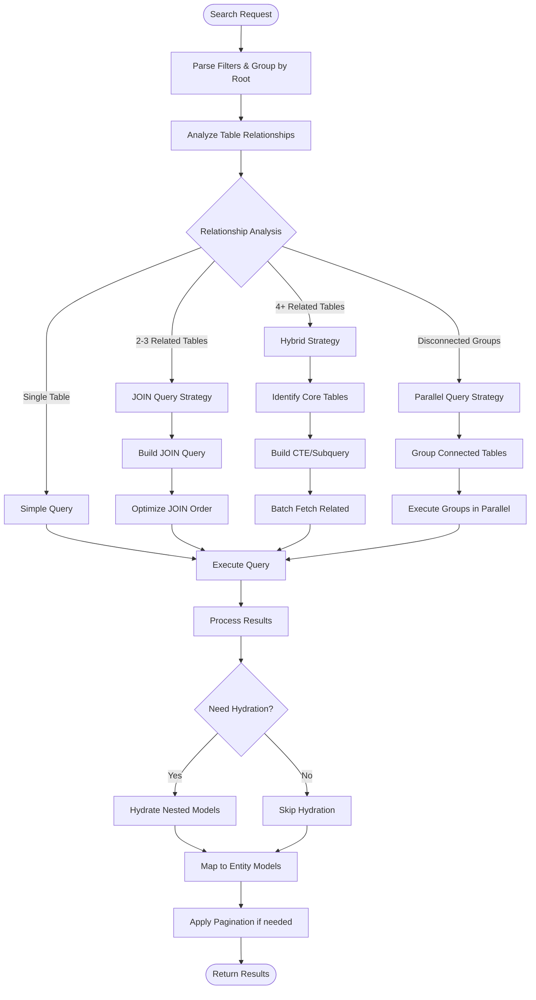

# Optimized Search Query Flow Documentation

## Overview
This document outlines the optimized search query strategy for the DIGIT CRUD Bloc, focusing on reducing database round trips and improving performance through intelligent query building.

## Core Principle
Instead of executing multiple sequential queries for related tables, we build optimized queries using JOINs, CTEs, or strategic batching based on the relationship complexity.

## Flow Diagram



## Decision Matrix

| Scenario | Tables | Relationships | Strategy | Reason |
|----------|--------|--------------|----------|---------|
| Simple Search | 1 | None | Direct Query | No relationships to traverse |
| Related Pair | 2 | 1-to-1 or 1-to-Many | INNER/LEFT JOIN | Efficient single query |
| Small Graph | 2-3 | Connected | Multi-JOIN | Optimizer handles well |
| Medium Graph | 4-5 | Connected | CTE + Selective JOIN | Balance complexity vs performance |
| Large Graph | 6+ | Complex | Strategic Batching | Avoid cartesian explosion |
| Disconnected | Any | Not Connected | Parallel Queries | Independent execution |

## Implementation Phases

### Phase 1: Query Analysis
```dart
class QueryAnalyzer {
  QueryStrategy analyzeQuery(
    List<SearchFilter> filters,
    Map<String, List<RelationshipMapping>> relationshipGraph,
    List<String> selectTables,
  ) {
    // 1. Group filters by root table
    final filterGroups = groupFiltersByRoot(filters);
    
    // 2. Identify table relationships
    final tableGraph = buildTableGraph(filterGroups.keys, selectTables, relationshipGraph);
    
    // 3. Calculate complexity score
    final complexity = calculateComplexity(tableGraph);
    
    // 4. Choose strategy
    return selectOptimalStrategy(complexity, tableGraph);
  }
}
```

### Phase 2: Query Building
```dart
abstract class QueryBuilder {
  String buildQuery();
}

class JoinQueryBuilder extends QueryBuilder {
  String buildQuery() {
    // 1. Determine optimal join order (smallest result set first)
    // 2. Build SELECT clause (only needed columns)
    // 3. Build FROM and JOIN clauses
    // 4. Build WHERE clause
    // 5. Add ORDER BY and LIMIT if needed
  }
}

class CTEQueryBuilder extends QueryBuilder {
  String buildQuery() {
    // 1. Build base CTE for filtered root tables
    // 2. Build related CTEs for each relationship level
    // 3. Final SELECT combining all CTEs
  }
}

class BatchQueryBuilder extends QueryBuilder {
  List<String> buildQueries() {
    // 1. Build primary query for main tables
    // 2. Build batch IN queries for related tables
    // 3. Return list of queries to execute
  }
}
```

### Phase 3: Execution Strategy

```dart
class QueryExecutor {
  Future<QueryResult> execute(QueryStrategy strategy) {
    switch (strategy.type) {
      case QueryType.single:
        return executeSingle(strategy);
      
      case QueryType.join:
        return executeJoin(strategy);
      
      case QueryType.cte:
        return executeCTE(strategy);
      
      case QueryType.batch:
        return executeBatch(strategy);
      
      case QueryType.parallel:
        return executeParallel(strategy);
    }
  }
}
```

## Optimization Rules

### 1. JOIN Optimization
- **Rule**: Use JOINs only when relationship cardinality is predictable
- **Threshold**: Max 3 tables in a single JOIN
- **Order**: Start with most selective filter (smallest result set)

### 2. Column Selection
```sql
-- Bad: SELECT * from all tables
SELECT * FROM users u JOIN orders o ON u.id = o.user_id

-- Good: Select only needed columns
SELECT 
  u.id, u.name,  -- Only needed from users
  o.*            -- Full data only for primary table
FROM users u 
JOIN orders o ON u.id = o.user_id
```

### 3. Index Utilization
Priority columns for indexing:
1. Foreign keys (used in JOINs)
2. Filter columns (used in WHERE)
3. Sort columns (used in ORDER BY)

### 4. Pagination Strategy
```dart
class PaginationStrategy {
  // For single table
  static String simplePagination(limit, offset) => 
    "LIMIT $limit OFFSET $offset";
  
  // For JOINs - use subquery
  static String joinPagination(primaryTable, limit, offset) => 
    "WHERE ${primaryTable}.id IN (
      SELECT id FROM ${primaryTable} 
      WHERE <filters>
      LIMIT $limit OFFSET $offset
    )";
  
  // For CTEs
  static String ctePagination(limit, offset) =>
    "WITH paginated_base AS (
      SELECT * FROM base_table
      LIMIT $limit OFFSET $offset
    )";
}
```

## Edge Cases & Solutions

### 1. Many-to-Many Relationships
**Problem**: Can cause result explosion
**Solution**: Use EXISTS subquery instead of JOIN
```sql
-- Instead of JOIN that multiplies rows
SELECT * FROM users u
WHERE EXISTS (
  SELECT 1 FROM user_roles ur 
  WHERE ur.user_id = u.id AND ur.role_id IN (1,2,3)
)
```

### 2. Circular Dependencies
**Problem**: A -> B -> C -> A
**Solution**: Break cycle at weakest link, use separate query

### 3. Optional Relationships (NULL foreign keys)
**Problem**: INNER JOIN excludes records
**Solution**: Use LEFT JOIN or separate queries

### 4. Large IN Clauses
**Problem**: IN clause with 1000+ values
**Solution**: Use temporary table or batch into chunks
```dart
if (inValues.length > 500) {
  // Split into batches
  final batches = chunk(inValues, 500);
  final results = await Future.wait(
    batches.map(batch => queryWithIn(batch))
  );
}
```

## Performance Metrics

Track these metrics to validate optimization:
1. **Query Count**: Reduce from N to 1-3
2. **Total Execution Time**: Target 50% reduction
3. **Memory Usage**: Monitor for large JOINs
4. **Database Connections**: Minimize concurrent connections

## Implementation Checklist

- [ ] Query Analyzer implementation
- [ ] JOIN Query Builder
- [ ] CTE Query Builder  
- [ ] Batch Query Builder
- [ ] Query Executor with strategy pattern
- [ ] Result processor and mapper
- [ ] Hydration optimizer
- [ ] Performance monitoring
- [ ] Unit tests for each strategy
- [ ] Integration tests with real data

## Query Strategy Decision Tree

```
filters.length == 1 && select.length == 1
  └─> Single Query

filters.involves(2 tables) && hasDirectRelation
  └─> JOIN Query

filters.involves(3-4 tables) && allConnected
  ├─> simpleRelations? -> Multi-JOIN Query
  └─> complexRelations? -> CTE Query

filters.involves(5+ tables)
  ├─> coreTablesCount <= 3? -> CTE + Batch
  └─> else -> Strategic Batch

filters.involves(disconnectedGroups)
  └─> Parallel Group Execution
```

## Example Scenarios

### Scenario 1: Simple Related Query
**Input**: Find users and their orders
**Strategy**: JOIN
```sql
SELECT u.id, u.name, o.*
FROM users u
LEFT JOIN orders o ON u.id = o.user_id
WHERE u.status = 'active'
LIMIT 10
```

### Scenario 2: Complex Multi-Level
**Input**: Users -> Orders -> Products -> Categories
**Strategy**: CTE + Selective JOIN
```sql
WITH active_users AS (
  SELECT id, name FROM users WHERE status = 'active'
),
user_orders AS (
  SELECT o.*, u.name as user_name
  FROM orders o
  JOIN active_users u ON o.user_id = u.id
)
SELECT uo.*, p.name as product_name, c.name as category_name
FROM user_orders uo
JOIN order_items oi ON uo.id = oi.order_id
JOIN products p ON oi.product_id = p.id
LEFT JOIN categories c ON p.category_id = c.id
```

### Scenario 3: Disconnected Filters
**Input**: Users (by status) + Products (by category) - no relation
**Strategy**: Parallel execution
```dart
final results = await Future.wait([
  queryUsers(statusFilter),
  queryProducts(categoryFilter),
]);
```

## Next Steps

1. Review and refine the strategy with team
2. Create POC for JOIN strategy
3. Benchmark against current implementation
4. Implement incrementally (start with 2-table JOINs)
5. Add monitoring and metrics
6. Optimize based on real-world usage patterns