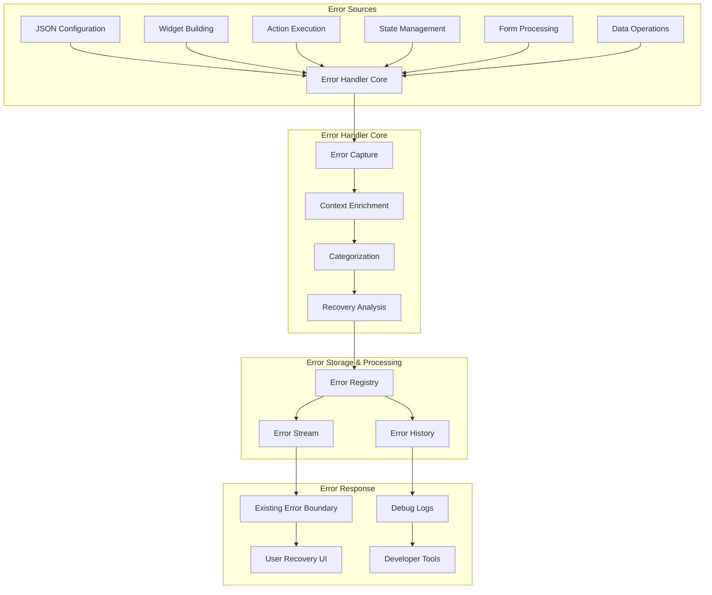

# DIGIT Flow Builder - Global Error Handler

## Table of Contents
1. [Overview](#overview)
2. [Architecture](#architecture)
3. [Error Types & Categories](#error-types--categories)
4. [Error Models](#error-models)
5. [Error Handler Service](#error-handler-service)
6. [Integration Points](#integration-points)
7. [Error Context Capture](#error-context-capture)
8. [Recovery Mechanisms](#recovery-mechanisms)
9. [Logging & Reporting](#logging--reporting)
10. [Configuration](#configuration)
11. [Implementation Guide](#implementation-guide)
12. [Best Practices](#best-practices)

## Overview

The DIGIT Flow Builder Global Error Handler is a comprehensive error tracking and recovery system designed to capture, analyze, and provide actionable insights for errors occurring during JSON-driven UI rendering, form processing, and data operations.

### Key Features

- **Comprehensive Error Capture**: Tracks errors from JSON parsing to UI rendering
- **Rich Context Information**: Captures JSON paths, invalid values, state snapshots
- **Recovery Actions**: Provides user-friendly recovery options
- **Debug Integration**: Works with existing error boundaries
- **Real-time Monitoring**: Stream-based error tracking
- **Detailed Logging**: Structured error logs for debugging

### Design Principles

1. **Non-Intrusive**: Minimal impact on existing code
2. **Context-Rich**: Maximum information for debugging
3. **User-Friendly**: Graceful degradation and recovery
4. **Developer-Focused**: Comprehensive debugging information
5. **Performance-Conscious**: Efficient error handling without overhead

## Architecture



## Error Types & Categories

### Primary Error Types

```dart
enum FlowErrorType {
  // JSON and Configuration Errors
  jsonParsing,           // Malformed JSON, syntax errors
  jsonValidation,        // Missing required fields, type mismatches
  configurationSchema,   // Invalid configuration structure

  // Widget and UI Errors
  widgetBuild,          // Widget creation failures
  widgetUnknown,        // Unknown widget format
  widgetProperty,       // Invalid widget properties

  // Action System Errors
  actionExecution,      // Action handler failures
  actionUnknown,        // Unknown action type
  actionConfiguration,  // Invalid action properties

  // State Management Errors
  stateUpdate,          // State update failures
  stateAccess,          // State access errors
  stateCorruption,      // State integrity issues

  // Form Processing Errors
  formValidation,       // Form validation failures
  formSubmission,       // Form submission errors
  formSchema,           // Schema validation errors

  // Data Operation Errors
  dataTransformation,   // Data mapping failures
  dataPersistence,      // CRUD operation errors
  dataRetrieval,        // Search/fetch errors

  // Navigation Errors
  navigationRoute,      // Route resolution failures
  navigationParams,     // Invalid navigation parameters

  // Template and Interpolation Errors
  interpolation,        // Template interpolation failures
  templateSyntax,       // Invalid template syntax

  // System Level Errors
  initialization,       // Initialization failures
  dependency,          // Missing dependencies
  network,             // Network operation errors
  unknown,             // Uncategorized errors
}
```

### Error Severity Levels

```dart
enum ErrorSeverity {
  critical,    // System crash, data loss risk, app unusable
  high,        // Feature completely broken, user blocked
  medium,      // Feature partially working, degraded experience
  low,         // Minor issues, workarounds available
  info,        // Non-critical information, logging purposes
  warning,     // Potential issues, preventive information
}
```

### Error Categories

```dart
enum ErrorCategory {
  userFacing,     // Errors that directly affect user experience
  developer,      // Errors requiring developer intervention
  configuration,  // Configuration-related errors
  system,         // System-level errors
  data,          // Data-related errors
  ui,            // UI rendering errors
}
```

## Error Models

### Core Error Model

```dart
class FlowError {
  // Unique identifier for tracking
  final String id;

  // Basic error information
  final FlowErrorType type;
  final ErrorSeverity severity;
  final ErrorCategory category;
  final String message;
  final String? detailedMessage;
  final DateTime timestamp;

  // Context and debugging information
  final ErrorContext context;
  final StackTrace? stackTrace;
  final Map<String, dynamic>? metadata;

  // Recovery and user assistance
  final List<RecoveryAction>? recoveryActions;
  final String? userFriendlyMessage;
  final String? documentationLink;

  // Tracking and analytics
  final bool isRecoverable;
  final bool isReported;
  final int occurrenceCount;

  FlowError({
    required this.type,
    required this.severity,
    required this.category,
    required this.message,
    required this.context,
    this.detailedMessage,
    this.stackTrace,
    this.metadata,
    this.recoveryActions,
    this.userFriendlyMessage,
    this.documentationLink,
    this.isRecoverable = true,
    this.isReported = false,
    this.occurrenceCount = 1,
  }) : id = _generateErrorId(),
       timestamp = DateTime.now();
}
```

### Error Context Model

```dart
class ErrorContext {
  // Screen and navigation context
  final String? screenName;
  final String? screenType;  // FORM, TEMPLATE
  final String? screenKey;
  final Map<String, dynamic>? navigationParams;

  // Widget context
  final String? widgetType;
  final String? widgetFormat;
  final Map<String, dynamic>? widgetConfig;

  // Action context
  final String? actionType;
  final Map<String, dynamic>? actionProperties;

  // JSON and configuration context
  final Map<String, dynamic>? jsonConfig;
  final String? jsonPath;           // e.g., "body[0].properties.type"
  final dynamic invalidValue;       // The actual invalid value
  final String? expectedType;       // Expected type/format
  final List<String>? validValues;  // List of valid values if applicable

  // State context
  final Map<String, dynamic>? stateSnapshot;
  final List<String>? stateKeys;
  final Map<String, dynamic>? formData;

  // User and session context
  final String? userId;
  final String? sessionId;
  final String? tenantId;
  final String? projectId;

  // Technical context
  final String? buildMode;          // debug, profile, release
  final String? platform;          // android, ios, web
  final String? appVersion;
  final String? packageVersion;

  ErrorContext({
    this.screenName,
    this.screenType,
    this.screenKey,
    this.navigationParams,
    this.widgetType,
    this.widgetFormat,
    this.widgetConfig,
    this.actionType,
    this.actionProperties,
    this.jsonConfig,
    this.jsonPath,
    this.invalidValue,
    this.expectedType,
    this.validValues,
    this.stateSnapshot,
    this.stateKeys,
    this.formData,
    this.userId,
    this.sessionId,
    this.tenantId,
    this.projectId,
    this.buildMode,
    this.platform,
    this.appVersion,
    this.packageVersion,
  });
}
```

### Recovery Action Model

```dart
class RecoveryAction {
  final String id;
  final String label;
  final String description;
  final RecoveryActionType type;
  final VoidCallback action;
  final IconData? icon;
  final bool isDestructive;
  final bool requiresConfirmation;

  RecoveryAction({
    required this.label,
    required this.description,
    required this.type,
    required this.action,
    this.icon,
    this.isDestructive = false,
    this.requiresConfirmation = false,
  }) : id = _generateActionId();
}

enum RecoveryActionType {
  retry,              // Retry the failed operation
  refresh,            // Refresh/reload current screen
  navigate,           // Navigate to different screen
  reset,              // Reset state/form
  fallback,          // Use fallback configuration
  contact,           // Contact support
  ignore,            // Ignore and continue
  reload,            // Reload entire app
}
```

## Error Handler Service

### Core Service Implementation

```dart
class FlowErrorHandler {
  static final FlowErrorHandler _instance = FlowErrorHandler._internal();
  factory FlowErrorHandler() => _instance;
  FlowErrorHandler._internal();

  // Configuration
  bool isEnabled = true;
  bool captureInRelease = false;
  int maxHistorySize = 500;
  Duration errorThrottleDuration = Duration(seconds: 1);

  // Storage
  final List<FlowError> _errorHistory = [];
  final Map<String, DateTime> _lastErrorTime = {};
  final Map<String, int> _errorCounts = {};

  // Streams
  final _errorStream = StreamController<FlowError>.broadcast();
  final _recoveryStream = StreamController<RecoveryAction>.broadcast();

  // Getters
  Stream<FlowError> get errorStream => _errorStream.stream;
  Stream<RecoveryAction> get recoveryStream => _recoveryStream.stream;
  List<FlowError> get errorHistory => List.unmodifiable(_errorHistory);
  Map<FlowErrorType, int> get errorStatistics => _calculateStatistics();

  /// Main error capture method
  FlowError captureError({
    required dynamic error,
    required FlowErrorType type,
    StackTrace? stackTrace,
    ErrorContext? context,
    Map<String, dynamic>? metadata,
    List<RecoveryAction>? recoveryActions,
  }) {
    if (!isEnabled || (!kDebugMode && !captureInRelease)) {
      return _createDummyError();
    }

    // Throttling check
    final errorKey = _generateErrorKey(error, type, context);
    if (_isThrottled(errorKey)) {
      _incrementErrorCount(errorKey);
      return _errorHistory.last;
    }

    // Create enriched context
    final enrichedContext = _enrichContext(context);

    // Determine severity and category
    final severity = _determineSeverity(type, error, enrichedContext);
    final category = _determineCategory(type);

    // Generate recovery actions if not provided
    final actions = recoveryActions ?? _generateRecoveryActions(type, error, enrichedContext);

    // Create flow error
    final flowError = FlowError(
      type: type,
      severity: severity,
      category: category,
      message: _extractMessage(error),
      detailedMessage: _generateDetailedMessage(error, enrichedContext),
      context: enrichedContext,
      stackTrace: stackTrace,
      metadata: metadata,
      recoveryActions: actions,
      userFriendlyMessage: _generateUserFriendlyMessage(type, error),
      documentationLink: _getDocumentationLink(type),
    );

    // Store and broadcast
    _addToHistory(flowError);
    _errorStream.add(flowError);

    // Log error
    _logError(flowError);

    // Report if needed
    if (_shouldReport(flowError)) {
      _reportError(flowError);
    }

    return flowError;
  }
}
```

### Specialized Capture Methods

```dart
extension FlowErrorHandlerSpecialized on FlowErrorHandler {
  /// Capture JSON-related errors with path information
  FlowError captureJsonError({
    required String jsonPath,
    required dynamic invalidValue,
    required Map<String, dynamic> fullJson,
    required dynamic error,
    String? expectedType,
    List<String>? validValues,
    StackTrace? stackTrace,
  }) {
    final context = ErrorContext(
      jsonConfig: fullJson,
      jsonPath: jsonPath,
      invalidValue: invalidValue,
      expectedType: expectedType,
      validValues: validValues,
    );

    return captureError(
      error: error,
      type: FlowErrorType.jsonParsing,
      context: context,
      stackTrace: stackTrace,
      metadata: {
        'jsonSize': fullJson.toString().length,
        'pathDepth': jsonPath.split('.').length,
      },
    );
  }

  /// Capture widget building errors
  FlowError captureWidgetError({
    required String widgetFormat,
    required Map<String, dynamic> widgetConfig,
    required dynamic error,
    StackTrace? stackTrace,
  }) {
    final context = ErrorContext(
      widgetFormat: widgetFormat,
      widgetConfig: widgetConfig,
      screenName: _getCurrentScreenName(),
    );

    return captureError(
      error: error,
      type: _isUnknownWidget(error) ? FlowErrorType.widgetUnknown : FlowErrorType.widgetBuild,
      context: context,
      stackTrace: stackTrace,
      metadata: {
        'registeredWidgets': FlowWidgetFactory.getFormats(),
        'configKeys': widgetConfig.keys.toList(),
      },
    );
  }

  /// Capture action execution errors
  FlowError captureActionError({
    required ActionConfig action,
    required dynamic error,
    required Map<String, dynamic> contextData,
    StackTrace? stackTrace,
  }) {
    final context = ErrorContext(
      actionType: action.actionType,
      actionProperties: action.properties,
      screenName: _getCurrentScreenName(),
      stateSnapshot: _captureStateSnapshot(),
    );

    return captureError(
      error: error,
      type: FlowErrorType.actionExecution,
      context: context,
      stackTrace: stackTrace,
      metadata: {
        'contextDataKeys': contextData.keys.toList(),
        'actionSize': action.toJson().toString().length,
      },
    );
  }

  /// Capture form-related errors
  FlowError captureFormError({
    required String schemaKey,
    required Map<String, dynamic> formData,
    required dynamic error,
    String? fieldName,
    StackTrace? stackTrace,
  }) {
    final context = ErrorContext(
      screenType: 'FORM',
      formData: formData,
      jsonPath: fieldName != null ? 'form.$fieldName' : 'form',
    );

    return captureError(
      error: error,
      type: FlowErrorType.formValidation,
      context: context,
      stackTrace: stackTrace,
      metadata: {
        'schemaKey': schemaKey,
        'formFields': formData.keys.toList(),
        'fieldName': fieldName,
      },
    );
  }

  /// Capture state management errors
  FlowError captureStateError({
    required String screenKey,
    required dynamic error,
    String? operation,
    StackTrace? stackTrace,
  }) {
    final context = ErrorContext(
      screenKey: screenKey,
      stateSnapshot: _captureStateSnapshot(),
      stateKeys: FlowCrudStateRegistry().getAllKeys(),
    );

    return captureError(
      error: error,
      type: FlowErrorType.stateUpdate,
      context: context,
      stackTrace: stackTrace,
      metadata: {
        'operation': operation,
        'totalStates': FlowCrudStateRegistry().getAllKeys().length,
      },
    );
  }
}
```

## Integration Points

### 1. Widget Registry Integration

```dart
// Enhanced WidgetRegistry with error handling
class WidgetRegistry {
  static Widget build(
    Map<String, dynamic> json,
    BuildContext context,
    void Function(ActionConfig) onAction,
  ) {
    try {
      final format = json['format'] as String? ?? '';

      // Validate widget format exists
      if (!FlowWidgetFactory.hasWidget(format)) {
        final error = FlowErrorHandler().captureJsonError(
          jsonPath: 'format',
          invalidValue: format,
          fullJson: json,
          error: 'Unknown widget format: $format',
          expectedType: 'string',
          validValues: FlowWidgetFactory.getFormats(),
        );

        return _buildErrorWidget(error, json);
      }

      return FlowWidgetFactory.build(json, context, onAction);

    } catch (e, stackTrace) {
      final error = FlowErrorHandler().captureWidgetError(
        widgetFormat: json['format'] ?? 'unknown',
        widgetConfig: json,
        error: e,
        stackTrace: stackTrace,
      );

      return _buildErrorWidget(error, json);
    }
  }

  static Widget _buildErrorWidget(FlowError error, Map<String, dynamic> config) {
    // Return user-friendly error widget that integrates with error boundary
    return FlowErrorWidget(
      error: error,
      fallbackWidget: _buildFallbackWidget(config),
    );
  }

  static Widget _buildFallbackWidget(Map<String, dynamic> config) {
    // Attempt to build a simple fallback based on config
    final text = config['label'] ?? config['text'] ?? 'Widget Error';
    return Container(
      padding: EdgeInsets.all(8),
      child: Text(text, style: TextStyle(color: Colors.red)),
    );
  }
}
```

### 2. Action Handler Integration

```dart
// Enhanced ActionHandler with comprehensive error tracking
class ActionHandler {
  static Future<Map<String, dynamic>> execute(
    ActionConfig action,
    BuildContext context,
    Map<String, dynamic> contextData,
  ) async {
    try {
      // Pre-execution validation
      _validateActionConfig(action);

      switch (action.actionType) {
        case 'FETCH_TRANSFORMER_CONFIG':
          return await _executeFetchTransformerConfig(action, context, contextData);

        case 'CREATE_EVENT':
          return await _executeCreateEvent(action, context, contextData);

        case 'SEARCH_EVENT':
          return await _executeSearchEvent(action, context, contextData);

        case 'NAVIGATION':
          return await _executeNavigation(action, context, contextData);

        case 'SHOW_TOAST':
          return await _executeShowToast(action, context, contextData);

        default:
          throw UnsupportedActionException('Unknown action type: ${action.actionType}');
      }

    } catch (e, stackTrace) {
      final error = FlowErrorHandler().captureActionError(
        action: action,
        error: e,
        contextData: contextData,
        stackTrace: stackTrace,
      );

      // Show user-friendly error message
      _showUserError(context, error);

      // Decide whether to rethrow or handle gracefully
      if (error.severity == ErrorSeverity.critical) {
        rethrow;
      } else {
        // Return error state that allows app to continue
        return {
          ...contextData,
          'hasError': true,
          'errorId': error.id,
          'errorMessage': error.userFriendlyMessage,
        };
      }
    }
  }

  static void _validateActionConfig(ActionConfig action) {
    if (action.actionType.isEmpty) {
      throw ValidationException('Action type cannot be empty');
    }

    // Action-specific validations
    switch (action.actionType) {
      case 'NAVIGATION':
        if (action.properties['type'] == null || action.properties['name'] == null) {
          throw ValidationException('Navigation action requires type and name');
        }
        break;
      case 'FETCH_TRANSFORMER_CONFIG':
        if (action.properties['configName'] == null) {
          throw ValidationException('Fetch transformer config requires configName');
        }
        break;
    }
  }

  static Future<Map<String, dynamic>> _executeFetchTransformerConfig(
    ActionConfig action,
    BuildContext context,
    Map<String, dynamic> contextData,
  ) async {
    try {
      final configName = action.properties['configName'];
      final transformerConfig = jsonConfig[configName]?['models'] as Map<String, dynamic>?;

      if (transformerConfig == null) {
        throw ConfigurationException('Transformer config not found: $configName');
      }

      // Continue with existing implementation...
      final formEntityMapper = FormEntityMapper(config: jsonConfig);
      // ... rest of the implementation

    } catch (e, stackTrace) {
      FlowErrorHandler().captureError(
        error: e,
        type: FlowErrorType.dataTransformation,
        stackTrace: stackTrace,
        metadata: {
          'configName': action.properties['configName'],
          'availableConfigs': jsonConfig.keys.toList(),
        },
      );
      rethrow;
    }
  }
}
```

### 3. JSON Parsing Integration

```dart
// Enhanced JSON parsing with detailed error tracking
class FlowConfigParser {
  static Map<String, dynamic> parseConfig(
    String jsonString, {
    String? source,
    String? identifier,
  }) {
    try {
      final parsed = json.decode(jsonString) as Map<String, dynamic>;
      _validateConfigStructure(parsed, source: source);
      return parsed;

    } catch (e, stackTrace) {
      FlowErrorHandler().captureJsonError(
        jsonPath: 'root',
        invalidValue: jsonString.length > 100
          ? '${jsonString.substring(0, 100)}...'
          : jsonString,
        fullJson: {},
        error: e,
        stackTrace: stackTrace,
      );
      rethrow;
    }
  }

  static T getRequiredField<T>(
    Map<String, dynamic> json,
    String fieldPath, {
    T? defaultValue,
    List<T>? validValues,
  }) {
    try {
      final keys = fieldPath.split('.');
      dynamic current = json;

      for (int i = 0; i < keys.length; i++) {
        final key = keys[i];
        if (current is! Map<String, dynamic> || !current.containsKey(key)) {
          if (defaultValue != null) {
            return defaultValue;
          }
          throw MissingFieldException('Required field missing: $fieldPath');
        }
        current = current[key];

        if (i == keys.length - 1) {
          if (current is! T) {
            throw TypeMismatchException(
              'Field $fieldPath expected type ${T.toString()}, got ${current.runtimeType}'
            );
          }

          if (validValues != null && !validValues.contains(current)) {
            throw InvalidValueException(
              'Field $fieldPath has invalid value: $current. Valid values: $validValues'
            );
          }

          return current as T;
        }
      }

      throw Exception('Unexpected error parsing field: $fieldPath');

    } catch (e, stackTrace) {
      FlowErrorHandler().captureJsonError(
        jsonPath: fieldPath,
        invalidValue: _getValueAtPath(json, fieldPath),
        fullJson: json,
        error: e,
        expectedType: T.toString(),
        validValues: validValues?.map((v) => v.toString()).toList(),
        stackTrace: stackTrace,
      );
      rethrow;
    }
  }
}
```

### 4. State Management Integration

```dart
// Enhanced FlowCrudStateRegistry with error handling
extension FlowCrudStateRegistryErrors on FlowCrudStateRegistry {
  void safeUpdate(String key, FlowCrudState state) {
    try {
      update(key, state);
    } catch (e, stackTrace) {
      FlowErrorHandler().captureStateError(
        screenKey: key,
        error: e,
        operation: 'update',
        stackTrace: stackTrace,
      );

      // Attempt recovery by clearing corrupted state
      try {
        clear(key);
      } catch (_) {
        // If clearing also fails, log critical error
        FlowErrorHandler().captureError(
          error: 'Failed to recover from state corruption',
          type: FlowErrorType.stateCorruption,
          metadata: {'screenKey': key},
        );
      }
    }
  }

  FlowCrudState? safeGet(String key) {
    try {
      return get(key);
    } catch (e, stackTrace) {
      FlowErrorHandler().captureStateError(
        screenKey: key,
        error: e,
        operation: 'get',
        stackTrace: stackTrace,
      );
      return null;
    }
  }
}
```

## Error Context Capture

### Automatic Context Enrichment

```dart
class ErrorContextEnricher {
  static ErrorContext enrichContext(ErrorContext? baseContext) {
    return ErrorContext(
      // Preserve existing context
      screenName: baseContext?.screenName ?? _getCurrentScreenName(),
      screenType: baseContext?.screenType ?? _getCurrentScreenType(),
      screenKey: baseContext?.screenKey ?? _getCurrentScreenKey(),
      navigationParams: baseContext?.navigationParams ?? _getCurrentNavigationParams(),

      // Widget context
      widgetType: baseContext?.widgetType,
      widgetFormat: baseContext?.widgetFormat,
      widgetConfig: baseContext?.widgetConfig,

      // Action context
      actionType: baseContext?.actionType,
      actionProperties: baseContext?.actionProperties,

      // JSON context
      jsonConfig: baseContext?.jsonConfig,
      jsonPath: baseContext?.jsonPath,
      invalidValue: baseContext?.invalidValue,
      expectedType: baseContext?.expectedType,
      validValues: baseContext?.validValues,

      // State context
      stateSnapshot: baseContext?.stateSnapshot ?? _captureCurrentState(),
      stateKeys: baseContext?.stateKeys ?? FlowCrudStateRegistry().getAllKeys(),
      formData: baseContext?.formData ?? _getCurrentFormData(),

      // User and session context
      userId: baseContext?.userId ?? FlowBuilderSingleton().loggedInUser?.uuid,
      sessionId: baseContext?.sessionId ?? _getSessionId(),
      tenantId: baseContext?.tenantId ?? FlowBuilderSingleton().selectedProject?.tenantId,
      projectId: baseContext?.projectId ?? FlowBuilderSingleton().selectedProject?.id,

      // Technical context
      buildMode: kDebugMode ? 'debug' : kProfileMode ? 'profile' : 'release',
      platform: _getPlatformString(),
      appVersion: _getAppVersion(),
      packageVersion: _getPackageVersion(),
    );
  }

  static Map<String, dynamic> _captureCurrentState() {
    try {
      final allKeys = FlowCrudStateRegistry().getAllKeys();
      final stateMap = <String, dynamic>{};

      for (final key in allKeys) {
        try {
          final state = FlowCrudStateRegistry().get(key);
          if (state != null) {
            stateMap[key] = {
              'hasStateWrapper': state.stateWrapper != null,
              'wrapperLength': state.stateWrapper?.length,
              'formDataKeys': state.formData?.keys.toList(),
            };
          }
        } catch (e) {
          stateMap[key] = {'error': e.toString()};
        }
      }

      return stateMap;
    } catch (e) {
      return {'captureError': e.toString()};
    }
  }
}
```

## Recovery Mechanisms

### Recovery Action Generation

```dart
class RecoveryActionGenerator {
  static List<RecoveryAction> generateRecoveryActions(
    FlowErrorType errorType,
    dynamic error,
    ErrorContext context,
  ) {
    final actions = <RecoveryAction>[];

    switch (errorType) {
      case FlowErrorType.jsonParsing:
      case FlowErrorType.jsonValidation:
        actions.addAll(_generateJsonRecoveryActions(context));
        break;

      case FlowErrorType.widgetBuild:
      case FlowErrorType.widgetUnknown:
        actions.addAll(_generateWidgetRecoveryActions(context));
        break;

      case FlowErrorType.actionExecution:
        actions.addAll(_generateActionRecoveryActions(context));
        break;

      case FlowErrorType.stateUpdate:
      case FlowErrorType.stateCorruption:
        actions.addAll(_generateStateRecoveryActions(context));
        break;

      case FlowErrorType.formValidation:
      case FlowErrorType.formSubmission:
        actions.addAll(_generateFormRecoveryActions(context));
        break;

      case FlowErrorType.navigationRoute:
        actions.addAll(_generateNavigationRecoveryActions(context));
        break;

      default:
        actions.addAll(_generateGenericRecoveryActions(context));
    }

    return actions;
  }

  static List<RecoveryAction> _generateJsonRecoveryActions(ErrorContext context) {
    return [
      RecoveryAction(
        label: 'Use Fallback Config',
        description: 'Load default configuration to continue',
        type: RecoveryActionType.fallback,
        icon: Icons.settings_backup_restore,
        action: () => _useFallbackConfig(context),
      ),
      RecoveryAction(
        label: 'Skip Invalid Field',
        description: 'Continue without the problematic field',
        type: RecoveryActionType.ignore,
        icon: Icons.skip_next,
        action: () => _skipInvalidField(context),
      ),
      RecoveryAction(
        label: 'Refresh Configuration',
        description: 'Reload configuration from server',
        type: RecoveryActionType.refresh,
        icon: Icons.refresh,
        action: () => _refreshConfiguration(context),
      ),
    ];
  }

  static List<RecoveryAction> _generateWidgetRecoveryActions(ErrorContext context) {
    return [
      RecoveryAction(
        label: 'Use Text Widget',
        description: 'Display content as simple text',
        type: RecoveryActionType.fallback,
        icon: Icons.text_fields,
        action: () => _useFallbackTextWidget(context),
      ),
      RecoveryAction(
        label: 'Hide Widget',
        description: 'Skip this widget and continue',
        type: RecoveryActionType.ignore,
        icon: Icons.visibility_off,
        action: () => _hideProblematicWidget(context),
      ),
      if (context.widgetFormat != null)
        RecoveryAction(
          label: 'Register Widget',
          description: 'Register missing widget type: ${context.widgetFormat}',
          type: RecoveryActionType.fallback,
          icon: Icons.add_circle,
          action: () => _registerMissingWidget(context),
        ),
    ];
  }

  static List<RecoveryAction> _generateActionRecoveryActions(ErrorContext context) {
    return [
      RecoveryAction(
        label: 'Retry Action',
        description: 'Attempt the action again',
        type: RecoveryActionType.retry,
        icon: Icons.replay,
        action: () => _retryAction(context),
      ),
      RecoveryAction(
        label: 'Skip Action',
        description: 'Continue without executing this action',
        type: RecoveryActionType.ignore,
        icon: Icons.skip_next,
        action: () => _skipAction(context),
      ),
      if (context.actionType == 'NAVIGATION')
        RecoveryAction(
          label: 'Go Back',
          description: 'Return to previous screen',
          type: RecoveryActionType.navigate,
          icon: Icons.arrow_back,
          action: () => _goBack(context),
        ),
    ];
  }

  static List<RecoveryAction> _generateStateRecoveryActions(ErrorContext context) {
    return [
      RecoveryAction(
        label: 'Reset Screen State',
        description: 'Clear state for current screen',
        type: RecoveryActionType.reset,
        icon: Icons.refresh,
        action: () => _resetScreenState(context),
        requiresConfirmation: true,
      ),
      RecoveryAction(
        label: 'Reset All States',
        description: 'Clear all application state',
        type: RecoveryActionType.reset,
        icon: Icons.clear_all,
        action: () => _resetAllStates(context),
        isDestructive: true,
        requiresConfirmation: true,
      ),
      RecoveryAction(
        label: 'Reload Screen',
        description: 'Reload current screen',
        type: RecoveryActionType.refresh,
        icon: Icons.refresh,
        action: () => _reloadScreen(context),
      ),
    ];
  }

  static List<RecoveryAction> _generateGenericRecoveryActions(ErrorContext context) {
    return [
      RecoveryAction(
        label: 'Retry',
        description: 'Try the operation again',
        type: RecoveryActionType.retry,
        icon: Icons.replay,
        action: () => _genericRetry(context),
      ),
      RecoveryAction(
        label: 'Go Home',
        description: 'Return to main screen',
        type: RecoveryActionType.navigate,
        icon: Icons.home,
        action: () => _navigateHome(context),
      ),
      RecoveryAction(
        label: 'Report Issue',
        description: 'Send error report to development team',
        type: RecoveryActionType.contact,
        icon: Icons.bug_report,
        action: () => _reportIssue(context),
      ),
    ];
  }
}
```

## Logging & Reporting

### Structured Error Logging

```dart
class FlowErrorLogger {
  static void logError(FlowError error) {
    final logLevel = _mapSeverityToLogLevel(error.severity);

    // Create structured log entry
    final logEntry = {
      'timestamp': error.timestamp.toIso8601String(),
      'errorId': error.id,
      'type': error.type.name,
      'severity': error.severity.name,
      'category': error.category.name,
      'message': error.message,
      'detailedMessage': error.detailedMessage,
      'context': _serializeContext(error.context),
      'metadata': error.metadata,
      'stackTrace': error.stackTrace?.toString(),
      'isRecoverable': error.isRecoverable,
      'occurrenceCount': error.occurrenceCount,
    };

    // Log to appropriate destination
    switch (logLevel) {
      case LogLevel.error:
      case LogLevel.critical:
        logger.e('FlowBuilder Error', error: logEntry);
        break;
      case LogLevel.warning:
        logger.w('FlowBuilder Warning', extra: logEntry);
        break;
      case LogLevel.info:
        logger.i('FlowBuilder Info', extra: logEntry);
        break;
    }

    // Send to external logging service if configured
    if (_shouldSendToExternalService(error)) {
      _sendToExternalService(logEntry);
    }
  }

  static Map<String, dynamic> _serializeContext(ErrorContext context) {
    return {
      'screen': {
        'name': context.screenName,
        'type': context.screenType,
        'key': context.screenKey,
        'navigationParams': context.navigationParams,
      },
      'widget': {
        'type': context.widgetType,
        'format': context.widgetFormat,
        'configSize': context.widgetConfig?.toString().length,
      },
      'action': {
        'type': context.actionType,
        'propertiesSize': context.actionProperties?.toString().length,
      },
      'json': {
        'path': context.jsonPath,
        'invalidValue': _sanitizeValue(context.invalidValue),
        'expectedType': context.expectedType,
        'validValues': context.validValues,
        'configSize': context.jsonConfig?.toString().length,
      },
      'state': {
        'keysCount': context.stateKeys?.length,
        'formDataKeys': context.formData?.keys.toList(),
      },
      'user': {
        'userId': context.userId,
        'tenantId': context.tenantId,
        'projectId': context.projectId,
      },
      'technical': {
        'buildMode': context.buildMode,
        'platform': context.platform,
        'appVersion': context.appVersion,
        'packageVersion': context.packageVersion,
      },
    };
  }

  static dynamic _sanitizeValue(dynamic value) {
    if (value == null) return null;

    final str = value.toString();
    if (str.length > 200) {
      return '${str.substring(0, 200)}... [truncated]';
    }
    return str;
  }
}
```

### Error Reporting Service

```dart
class FlowErrorReporter {
  static Future<void> reportError(FlowError error) async {
    if (!_shouldReport(error)) return;

    try {
      final report = _generateErrorReport(error);

      // Send to analytics service
      await _sendToAnalytics(report);

      // Send to crash reporting service
      if (error.severity == ErrorSeverity.critical) {
        await _sendToCrashReporting(error);
      }

      // Send to development team if needed
      if (_requiresDeveloperAttention(error)) {
        await _notifyDevelopers(error);
      }

    } catch (e) {
      // Don't let error reporting crash the app
      debugPrint('Failed to report error: $e');
    }
  }

  static Map<String, dynamic> _generateErrorReport(FlowError error) {
    return {
      'errorId': error.id,
      'type': error.type.name,
      'severity': error.severity.name,
      'message': error.message,
      'timestamp': error.timestamp.toIso8601String(),
      'context': {
        'screenName': error.context.screenName,
        'widgetFormat': error.context.widgetFormat,
        'actionType': error.context.actionType,
        'jsonPath': error.context.jsonPath,
        'platform': error.context.platform,
        'buildMode': error.context.buildMode,
        'appVersion': error.context.appVersion,
      },
      'metrics': {
        'occurrenceCount': error.occurrenceCount,
        'isRecoverable': error.isRecoverable,
        'hasRecoveryActions': error.recoveryActions?.isNotEmpty ?? false,
      },
    };
  }
}
```

## Configuration

### Error Handler Configuration

```dart
class FlowErrorHandlerConfig {
  final bool isEnabled;
  final bool captureInRelease;
  final bool showDebugUI;
  final int maxHistorySize;
  final Duration errorThrottleDuration;
  final Set<FlowErrorType> enabledErrorTypes;
  final ErrorSeverity minimumSeverity;
  final bool enableAutoRecovery;
  final bool enableErrorReporting;
  final String? externalLoggingEndpoint;
  final String? crashReportingKey;

  const FlowErrorHandlerConfig({
    this.isEnabled = true,
    this.captureInRelease = false,
    this.showDebugUI = false,
    this.maxHistorySize = 500,
    this.errorThrottleDuration = const Duration(seconds: 1),
    this.enabledErrorTypes = const {},
    this.minimumSeverity = ErrorSeverity.low,
    this.enableAutoRecovery = true,
    this.enableErrorReporting = true,
    this.externalLoggingEndpoint,
    this.crashReportingKey,
  });

  factory FlowErrorHandlerConfig.debug() {
    return FlowErrorHandlerConfig(
      isEnabled: true,
      captureInRelease: false,
      showDebugUI: true,
      maxHistorySize: 1000,
      enableAutoRecovery: false, // Let developers see all errors
      enableErrorReporting: false,
    );
  }

  factory FlowErrorHandlerConfig.production() {
    return FlowErrorHandlerConfig(
      isEnabled: true,
      captureInRelease: true,
      showDebugUI: false,
      maxHistorySize: 100,
      minimumSeverity: ErrorSeverity.medium,
      enableAutoRecovery: true,
      enableErrorReporting: true,
    );
  }
}
```

### Integration with Main App

```dart
// In main app initialization
void initializeFlowBuilder() {
  // Configure error handler
  FlowErrorHandler().configure(
    kDebugMode
      ? FlowErrorHandlerConfig.debug()
      : FlowErrorHandlerConfig.production()
  );

  // Set up error stream listener
  FlowErrorHandler().errorStream.listen((error) {
    // Forward to existing error boundary or crash reporting
    if (error.severity == ErrorSeverity.critical) {
      // Trigger existing error boundary
      FlutterError.reportError(FlutterErrorDetails(
        exception: error,
        stack: error.stackTrace,
        library: 'digit_flow_builder',
        context: ErrorDescription(error.message),
      ));
    }
  });

  // Initialize flow registry
  FlowRegistry.setConfig(flowConfigurations);

  // Initialize widget registry with error handling
  WidgetRegistry.initialize();
}
```

## Implementation Guide

### Phase 1: Core Error Handler
1. **Create Error Models** (`lib/error_handler/models/`)
   - `flow_error.dart` - Core error model
   - `error_context.dart` - Error context model
   - `recovery_action.dart` - Recovery action model

2. **Implement Core Service** (`lib/error_handler/`)
   - `flow_error_handler.dart` - Main error handler service
   - `error_context_enricher.dart` - Context enrichment
   - `error_severity_analyzer.dart` - Severity determination

3. **Add Error Streaming**
   - Error stream for real-time monitoring
   - Error history management
   - Error throttling and deduplication

### Phase 2: Integration Points
1. **Widget Registry Integration**
   - Modify `WidgetRegistry.build()` method
   - Add error capture for unknown widgets
   - Implement fallback widget rendering

2. **Action Handler Integration**
   - Enhance `ActionHandler.execute()` method
   - Add pre-execution validation
   - Implement graceful error handling

3. **JSON Parsing Integration**
   - Create `FlowConfigParser` utility
   - Add field validation helpers
   - Implement detailed path tracking

4. **State Management Integration**
   - Extend `FlowCrudStateRegistry`
   - Add safe state operations
   - Implement state corruption recovery

### Phase 3: Recovery System
1. **Recovery Action Generation**
   - Implement `RecoveryActionGenerator`
   - Create action-specific recovery strategies
   - Add user confirmation for destructive actions

2. **Recovery Execution**
   - Implement recovery action handlers
   - Add recovery result tracking
   - Create recovery success metrics

3. **Fallback Mechanisms**
   - Default configurations
   - Simple widget fallbacks
   - State reset procedures

### Phase 4: Logging & Reporting
1. **Structured Logging**
   - Implement `FlowErrorLogger`
   - Add log level mapping
   - Create structured log format

2. **External Reporting**
   - Implement `FlowErrorReporter`
   - Add analytics integration
   - Create crash reporting pipeline

3. **Error Analytics**
   - Error trend analysis
   - Performance impact measurement
   - User impact assessment

### Phase 5: Configuration & UI
1. **Configuration System**
   - Create `FlowErrorHandlerConfig`
   - Add environment-specific configs
   - Implement runtime configuration updates

2. **Debug UI Components**
   - Error history viewer
   - Error detail inspector
   - Recovery action tester

3. **Integration Testing**
   - Error scenario simulation
   - Recovery action validation
   - Performance impact testing

## Best Practices

### 1. Error Capture
- **Capture Early**: Capture errors as close to their source as possible
- **Rich Context**: Include maximum context without sensitive data
- **Appropriate Severity**: Use correct error types and severity levels
- **Avoid Duplicates**: Use throttling to prevent spam from repeated errors

### 2. Recovery Actions
- **Meaningful Options**: Provide recovery actions that actually help users
- **Test Thoroughly**: Ensure all recovery actions work as expected
- **User Confirmation**: Require confirmation for destructive actions
- **Progressive Fallback**: Start with least disruptive recovery options

### 3. Performance
- **Lightweight Handling**: Keep error handling overhead minimal
- **Lazy Context**: Use lazy evaluation for expensive context capture
- **Proper Throttling**: Implement appropriate error throttling
- **Memory Management**: Clean up old error history periodically

### 4. Privacy & Security
- **Data Sanitization**: Remove sensitive information from error logs
- **User Consent**: Respect user privacy settings for error reporting
- **Secure Transmission**: Use secure channels for error reporting
- **Access Control**: Implement proper access controls for error data

### 5. Development Workflow
- **Error Categories**: Use consistent error categorization
- **Documentation**: Document common errors and their solutions
- **Monitoring**: Set up alerts for critical errors
- **Regular Review**: Regularly review and analyze error patterns

### 6. Testing
- **Error Scenarios**: Create comprehensive error test scenarios
- **Recovery Testing**: Test all recovery mechanisms thoroughly
- **Integration Testing**: Validate error handling across components
- **Performance Testing**: Measure error handling performance impact

### 7. Maintenance
- **Regular Updates**: Keep error handling logic updated
- **Pattern Analysis**: Analyze error patterns for improvements
- **User Feedback**: Incorporate user feedback on error experiences
- **Continuous Improvement**: Continuously refine error handling based on data

This comprehensive error handling system will provide detailed insights into issues occurring within the DIGIT Flow Builder package while maintaining excellent user experience and enabling quick debugging and recovery.