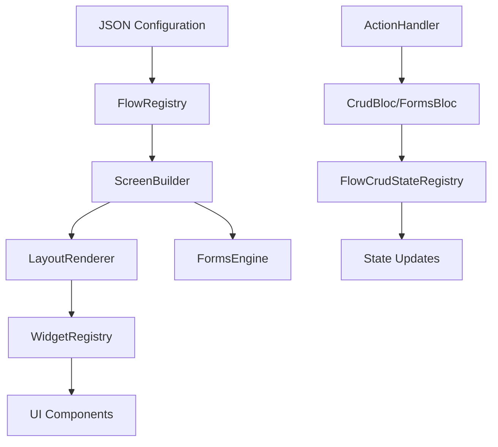

# DIGIT Flow Builder - Technical Documentation

## Overview

The `digit_flow_builder` package is a JSON-driven dynamic UI system that enables creating configurable screens, forms, and user flows without requiring code changes. It allows non-developers to define complex UI workflows through declarative JSON configurations.

## Architecture Components

### Core Components



### Component Details

#### 1. FlowRegistry (`flow_builder.dart:13-28`)
**Purpose**: Central configuration store for all flow definitions
- Stores flow configurations by name
- Provides lookup methods for screen configurations
- Simple map-based storage system

```dart
class FlowRegistry {
  static final Map<String, Map<String, dynamic>> _flowMap = {};
  
  static void setConfig(List<Map<String, dynamic>> flows);
  static Map<String, dynamic>? getByName(String name);
}
```

#### 2. ScreenBuilder (`screen_builder.dart:57-124`)
**Purpose**: Main screen orchestrator that determines rendering strategy
- Handles two screen types: FORM and TEMPLATE
- Manages screen-level state and lifecycle
- Integrates with forms engine and layout renderer

**Screen Types**:
- **FORM**: Uses `digit_forms_engine` for structured form rendering
- **TEMPLATE**: Uses `LayoutRenderer` for flexible UI compositions

#### 3. LayoutRenderer (`layout_renderer.dart:14-141`)
**Purpose**: Renders TEMPLATE-type screens with dynamic layouts
- Processes body and actions from configuration
- Handles header, footer, and content areas
- Manages screen-level actions and navigation

#### 4. WidgetRegistry (`widget_registry.dart:18-338`)
**Purpose**: Maps JSON format strings to Flutter widgets
- Supports 11 widget formats (button, card, listView, etc.)
- Handles widget properties and styling
- Manages widget-level actions and events

**Supported Widget Formats**:
- `button` - Interactive buttons with various styles
- `searchBar` - Search input with real-time filtering
- `card` - Container widgets with different types
- `filter` - Filter buttons for data manipulation
- `infoCard` - Informational display cards
- `column` - Vertical layout container
- `row` - Horizontal layout container
- `text` - Text display with interpolation
- `switch` - Toggle switches
- `tag` - Status/label tags
- `listView` - Dynamic list rendering

#### 5. ActionHandler (`action_handler/action_handler.dart:14-124`)
**Purpose**: Executes business logic and handles user interactions

**Supported Action Types**:
- `FETCH_TRANSFORMER_CONFIG` - Data transformation setup
- `CREATE_EVENT` - Entity creation via CrudBloc
- `SEARCH_EVENT` - Search operations
- `NAVIGATION` - Screen transitions
- `SHOW_TOAST` - User notifications

## Configuration Structure

### Basic Screen Configuration
```json
{
  "screenType": "TEMPLATE|FORM",
  "name": "screenKey",
  "heading": "Screen Title",
  "description": "Screen Description",
  "body": [...], // UI components
  "actions": [...], // Footer actions
  "wrapperConfig": {...}, // Data binding rules
  "onSubmit": [...] // Action chain on form submission
}
```

### Widget Configuration
```json
{
  "format": "widgetType",
  "label": "Widget Label",
  "fieldName": "fieldIdentifier",
  "properties": {...}, // Widget-specific properties
  "onAction": {...}, // Action configuration
  "hidden": "{{expression}}", // Conditional visibility
  "children": [...] // Child widgets for containers
}
```

### Data Wrapper Configuration
```json
{
  "wrapperConfig": {
    "wrapperName": "HouseholdWrapper",
    "rootEntity": "HouseholdMemberModel",
    "filters": [
      {"field": "isHeadOfHousehold", "equals": true}
    ],
    "relations": [
      {
        "name": "household",
        "entity": "HouseholdModel",
        "match": {
          "field": "clientReferenceId",
          "equalsFrom": "householdClientReferenceId"
        }
      }
    ]
  }
}
```

## CRITICAL ISSUES AND LIMITATIONS

### 🚨 Issue #1: ListView Data Context Problem

**Location**: `widget_registry.dart:187-226`

**Current Implementation**:
```dart
WidgetRegistry.register('listView', (json, context, onAction) {
  // PROBLEM: Hardcoded dummy data
  dataSource = [
    {
      "name": "HEADDF",
      "gender": "Female",
      "age": 35,
      // ... more hardcoded data
    }
  ];
  
  return Column(
    children: (dataSource as List)
        .map<Widget>((item) {
          final childJson = Map<String, dynamic>.from(json['child']);
          childJson['item'] = item; // PROBLEM: Direct JSON mutation
          return LayoutMapper.map(childJson, context, onAction);
        })
  );
});
```

**Issues**:
1. **Hardcoded Data**: Uses dummy data instead of dynamic resolution
2. **No Context Isolation**: List items don't have isolated data contexts
3. **JSON Mutation**: Direct modification of configuration objects
4. **Missing Data Binding**: No proper interpolation for item-specific data

**Impact**:
- All list items show the same hardcoded data
- No dynamic data binding to state wrapper
- Configuration objects get corrupted
- Poor performance and memory usage

### 🚨 Issue #2: Limited Data Interpolation

**Location**: `widget_registry.dart:302-337`

**Current Implementation**:
```dart
String _interpolateWithCrudStates(String template, List<dynamic>? state) {
  // Only supports: {{context.ModelName.field}}
  final regex = RegExp(r'\{\{\s*context\.([A-Za-z_][\w]*)\.([\w.]+)\s*\}\}');
  // Missing: {{item.field}}, {{global.field}}, conditional expressions
}
```

**Issues**:
1. **Single Pattern Support**: Only `{{context.Model.field}}` pattern
2. **No Item Interpolation**: Missing `{{item.field}}` for list items
3. **No Global Context**: No `{{global.field}}` support
4. **No Expressions**: No conditional or computed expressions
5. **No Fallback Values**: No default value mechanism

**Impact**:
- Limited dynamic content capabilities
- Poor list item rendering
- No conditional content
- Brittle template system

### 🚨 Issue #3: Weak State Management

**Problems**:
1. **Global Singleton**: `FlowCrudStateRegistry` is a global singleton
2. **No State Scoping**: No isolation between screens or components
3. **Memory Leaks**: Persistent listeners without proper cleanup
4. **No Type Safety**: Dynamic typing throughout state system
5. **No Validation**: No state structure validation

**Impact**:
- Unpredictable state behavior
- Memory leaks in production
- Difficult debugging
- Poor performance with multiple screens

### 🚨 Issue #4: Inflexible Widget System

**Problems**:
1. **Hardcoded Builders**: All widgets hardcoded in single registry
2. **No Plugin Architecture**: Cannot extend with custom widgets
3. **No Validation**: No configuration schema validation
4. **No Fallback**: No graceful degradation for unknown widgets
5. **Poor Error Handling**: Limited error reporting and recovery

**Impact**:
- Difficult to extend
- Poor developer experience
- Runtime failures
- Maintenance complexity

## PROPOSED SOLUTIONS

### Solution #1: Enhanced Data Context System

```dart
class DataContext extends InheritedWidget {
  final Map<String, dynamic> globalData;
  final Map<String, dynamic>? itemContext;
  final List<dynamic>? stateWrapper;
  final String? screenKey;
  
  // Provide hierarchical data resolution
  dynamic getValue(String key) {
    return itemContext?[key] ?? 
           globalData[key] ?? 
           _resolveFromStateWrapper(key);
  }
}
```

### Solution #2: Advanced Interpolation Engine

```dart
class InterpolationEngine {
  static String interpolate(String template, {
    Map<String, dynamic>? itemContext,
    List<dynamic>? stateWrapper,
    Map<String, dynamic>? globalContext,
  });
  
  // Support patterns:
  // {{item.field}}              - Current list item
  // {{context.Model.field}}     - State wrapper data
  // {{global.field}}            - Global application data
  // {{field || defaultValue}}   - Fallback values
  // {{#if condition}}...{{/if}} - Conditional blocks
}
```

### Solution #3: Plugin-based Widget Registry

```dart
abstract class WidgetBuilder {
  String get format;
  Widget build(Map<String, dynamic> config, BuildContext context);
  bool validate(Map<String, dynamic> config);
  Map<String, dynamic> getSchema();
}

class PluggableWidgetRegistry {
  static void register(WidgetBuilder builder);
  static void unregister(String format);
  static Widget build(Map<String, dynamic> config, BuildContext context);
}
```

### Solution #4: Scoped State Management

```dart
class FlowStateManager {
  final String screenKey;
  final StreamController<FlowState> _controller;
  
  void setState(FlowState state);
  Stream<FlowState> get stateStream;
  void dispose(); // Proper cleanup
}
```

## IMPROVEMENT ROADMAP

### Phase 1: Critical Fixes (Priority: HIGH)
- [ ] **Fix ListView Data Binding**: Implement proper data context isolation
- [ ] **Enhanced Interpolation**: Support multiple interpolation patterns
- [ ] **State Management**: Implement scoped state management
- [ ] **Error Handling**: Add comprehensive error handling and reporting
- [ ] **Memory Management**: Fix memory leaks and implement proper cleanup

### Phase 2: Enhanced Features (Priority: MEDIUM)
- [ ] **Conditional Rendering**: Support `hidden` expressions and conditional blocks
- [ ] **Expression Engine**: Implement expression evaluation for dynamic content
- [ ] **Plugin System**: Create pluggable widget architecture
- [ ] **Schema Validation**: Add configuration schema validation
- [ ] **Performance Optimization**: Optimize rendering and state updates

### Phase 3: Developer Experience (Priority: MEDIUM)
- [ ] **Configuration Editor**: Visual configuration editor tool
- [ ] **Documentation Generator**: Auto-generate widget documentation
- [ ] **Debug Tools**: Runtime debugging and inspection tools
- [ ] **Testing Framework**: Testing utilities for configurations
- [ ] **Migration Tools**: Configuration migration and validation tools

### Phase 4: Advanced Capabilities (Priority: LOW)
- [ ] **Animation Support**: Transition and animation configurations
- [ ] **Accessibility**: Enhanced accessibility features
- [ ] **Internationalization**: Multi-language support
- [ ] **Theming**: Dynamic theme support
- [ ] **Real-time Updates**: Live configuration updates

## DEVELOPMENT GUIDELINES

### Configuration Design Principles

1. **Declarative Over Imperative**
   ```json
   ✅ Good: { "format": "text", "value": "{{item.name}}" }
   ❌ Bad:  { "format": "text", "getValue": "getName" }
   ```

2. **Explicit Data Binding**
   ```json
   ✅ Good: { "data": "{{stateWrapper.members}}" }
   ❌ Bad:  { "data": "members" }
   ```

3. **Consistent Property Names**
   ```json
   ✅ Good: "fieldName", "actionType", "properties"
   ❌ Bad:  "field", "type", "props"
   ```

4. **Validation-First Design**
   ```json
   ✅ Good: Include schema validation for all configurations
   ❌ Bad:  Runtime discovery of configuration issues
   ```

### Widget Development Guidelines

1. **Always Validate Configuration**
   ```dart
   @override
   Widget build(Map<String, dynamic> config, BuildContext context) {
     if (!validate(config)) {
       return ErrorWidget('Invalid configuration for ${format}');
     }
     // ... build widget
   }
   ```

2. **Provide Fallback Values**
   ```dart
   final label = config['label'] as String? ?? 'Default Label';
   final isVisible = config['hidden'] == null || !evaluateExpression(config['hidden']);
   ```

3. **Support Accessibility**
   ```dart
   return Semantics(
     label: config['semanticsLabel'] ?? config['label'],
     child: widget,
   );
   ```

4. **Handle Loading States**
   ```dart
   return FutureBuilder(
     future: loadData(),
     builder: (context, snapshot) {
       if (snapshot.connectionState == ConnectionState.waiting) {
         return const CircularProgressIndicator();
       }
       return buildWidget(snapshot.data);
     },
   );
   ```

### State Management Guidelines

1. **Use Scoped State**
   ```dart
   // ✅ Good: Scoped to screen/component
   final stateManager = FlowStateManager(screenKey: 'searchBeneficiary');
   
   // ❌ Bad: Global singleton
   FlowCrudStateRegistry().setState(state);
   ```

2. **Implement Proper Cleanup**
   ```dart
   @override
   void dispose() {
     stateManager.dispose();
     super.dispose();
   }
   ```

3. **Validate State Transitions**
   ```dart
   bool canTransitionTo(FlowState newState) {
     return validTransitions[currentState.type]?.contains(newState.type) ?? false;
   }
   ```

## TESTING STRATEGY

### Unit Testing
```dart
// Test widget builders
testWidgets('Button widget renders correctly', (tester) async {
  final config = {
    'format': 'button',
    'label': 'Test Button',
    'properties': {'type': 'primary'}
  };
  
  final widget = WidgetRegistry.build(config, context, onAction);
  expect(widget, isA<DigitButton>());
});

// Test interpolation
test('Interpolation handles item context', () {
  final result = InterpolationEngine.interpolate(
    '{{item.name}}',
    itemContext: {'name': 'John'},
  );
  expect(result, equals('John'));
});
```

### Integration Testing
```dart
// Test complete screen rendering
testWidgets('Search screen renders with data', (tester) async {
  final config = FlowRegistry.getByName('searchBeneficiary');
  final screen = ScreenBuilder(config: config!);
  
  await tester.pumpWidget(screen);
  expect(find.text('Search Beneficiary'), findsOneWidget);
});
```

### E2E Testing
```dart
// Test complete user workflows
testWidgets('Complete beneficiary registration flow', (tester) async {
  // Navigate to search screen
  // Search for beneficiary
  // Navigate to registration form
  // Fill and submit form
  // Verify success screen
});
```

## MIGRATION STRATEGY

### Backward Compatibility
1. **Maintain Existing APIs**: Keep current FlowRegistry interface
2. **Gradual Migration**: Allow both old and new systems to coexist
3. **Deprecation Warnings**: Provide clear migration paths
4. **Configuration Versioning**: Support multiple configuration versions

### Migration Steps
1. **Phase 1**: Implement new systems alongside existing ones
2. **Phase 2**: Migrate critical screens to new system
3. **Phase 3**: Deprecate old system with warnings
4. **Phase 4**: Remove deprecated code

### Migration Tools
```dart
class ConfigurationMigrator {
  static Map<String, dynamic> migrateToV2(Map<String, dynamic> v1Config);
  static List<MigrationWarning> validate(Map<String, dynamic> config);
  static String generateMigrationReport();
}
```

## PERFORMANCE CONSIDERATIONS

### Current Performance Issues
1. **Excessive Widget Rebuilds**: Poor state management causes unnecessary rebuilds
2. **Memory Leaks**: Persistent listeners and global state
3. **Large Configuration Parsing**: JSON parsing on every render
4. **Inefficient List Rendering**: No virtualization for large lists

### Optimization Recommendations
1. **Widget Caching**: Cache parsed widget configurations
2. **Virtual Scrolling**: Implement virtualization for large lists
3. **State Optimization**: Use immutable state and selective updates
4. **Configuration Compilation**: Pre-compile configurations for better performance

## SECURITY CONSIDERATIONS

### Current Security Gaps
1. **No Input Validation**: Configurations not validated for malicious content
2. **Expression Injection**: No protection against code injection in expressions
3. **State Exposure**: Global state could leak sensitive information

### Security Recommendations
1. **Configuration Sanitization**: Validate and sanitize all configurations
2. **Expression Sandboxing**: Secure expression evaluation environment
3. **Access Control**: Implement role-based configuration access
4. **Audit Logging**: Log configuration changes and access

## CONCLUSION

The digit_flow_builder package provides a powerful foundation for dynamic UI generation but requires significant improvements to be production-ready. The proposed solutions address critical issues while maintaining backward compatibility and providing a clear upgrade path.

Priority should be given to fixing the ListView data context problem and implementing proper state management, as these issues directly impact functionality and user experience.