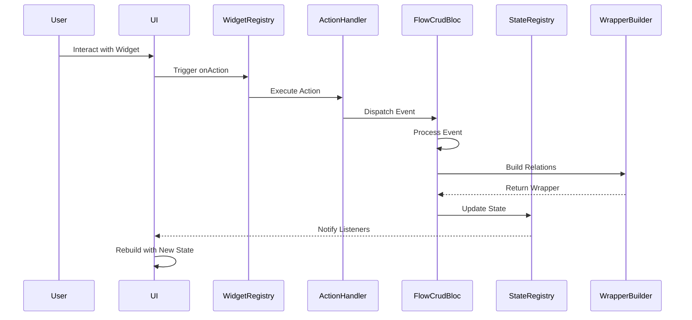
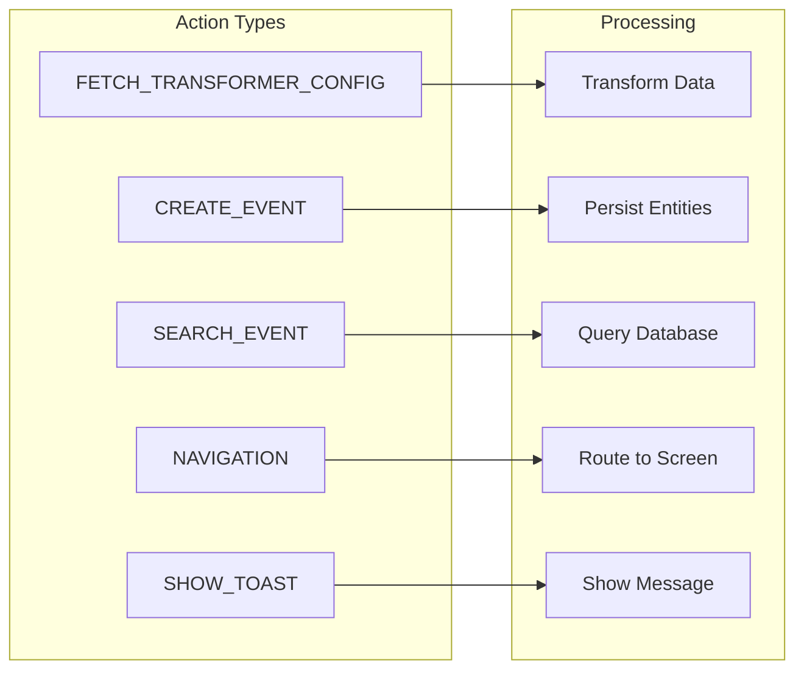
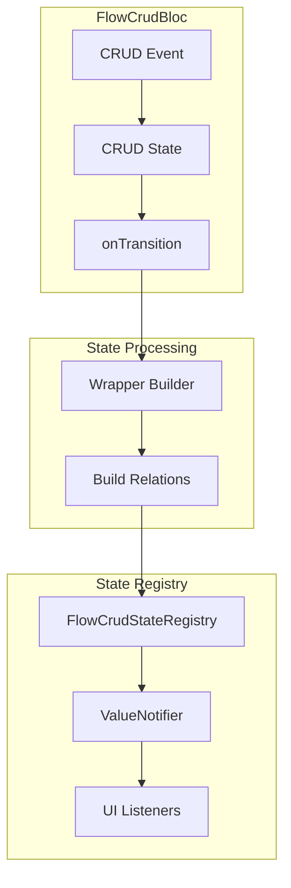
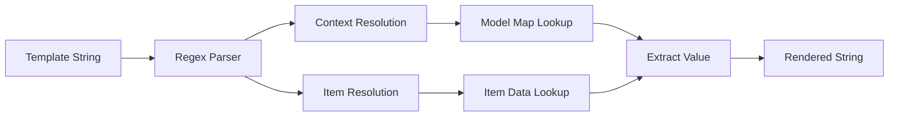

# DIGIT Flow Builder Documentation

## Table of Contents
1. [Overview](#overview)
2. [Architecture](#architecture)
3. [Core Components](#core-components)
4. [Widget Registry](#widget-registry)
5. [Action System](#action-system)
6. [State Management](#state-management)
7. [Data Flow & Interpolation](#data-flow--interpolation)
8. [Configuration Structure](#configuration-structure)
9. [Usage Examples](#usage-examples)
10. [API Reference](#api-reference)
11. [Best Practices](#best-practices)
12. [Troubleshooting](#troubleshooting)

## Overview

DIGIT Flow Builder is a powerful JSON-driven dynamic UI rendering framework that enables the creation of configurable forms and templates without code changes. It provides a declarative approach to building complex user interfaces with integrated state management, data binding, and action handling capabilities.

### Key Features
- **Dynamic UI Generation**: Create forms and templates from JSON configurations
- **Bidirectional Data Binding**: Automatic synchronization between UI and data models  
- **State Management**: Integrated CRUD state management with reactive updates
- **Action System**: Comprehensive event handling for navigation, CRUD operations, and UI interactions
- **Widget Registry**: Extensible widget system with 11+ pre-built components
- **Interpolation Support**: Dynamic content rendering with context-aware data binding
- **Form Integration**: Seamless integration with digit_forms_engine for complex forms
- **Wrapper System**: Data relationship mapping for complex entity hierarchies

## Architecture

[//]: # (### High-Level Architecture Flow)

[//]: # (```mermaid)

[//]: # (graph TB)

[//]: # (    subgraph "Configuration Layer")

[//]: # (        JSON[JSON Configuration])

[//]: # (        FlowRegistry[Flow Registry])

[//]: # (    end)

[//]: # (    )
[//]: # (    subgraph "Screen Layer")

[//]: # (        ScreenBuilder[Screen Builder])

[//]: # (        ScreenKeyListener[Screen Key Listener])

[//]: # (    end)

[//]: # (    )
[//]: # (    subgraph "Rendering Layer")

[//]: # (        LayoutRenderer[Layout Renderer])

[//]: # (        FormsEngine[Forms Engine])

[//]: # (        WidgetRegistry[Widget Registry])

[//]: # (    end)

[//]: # (    )
[//]: # (    subgraph "State Management")

[//]: # (        FlowCrudBloc[Flow CRUD Bloc])

[//]: # (        StateRegistry[State Registry])

[//]: # (        CrudItemContext[CRUD Item Context])

[//]: # (    end)

[//]: # (    )
[//]: # (    subgraph "Action System")

[//]: # (        ActionHandler[Action Handler])

[//]: # (        ActionConfig[Action Config])

[//]: # (        NavigationService[Navigation Service])

[//]: # (    end)

[//]: # (    )
[//]: # (    subgraph "Data Processing")

[//]: # (        Interpolation[Interpolation Engine])

[//]: # (        WrapperBuilder[Wrapper Builder])

[//]: # (        FormEntityMapper[Form Entity Mapper])

[//]: # (    end)

[//]: # (    )
[//]: # (    JSON --> FlowRegistry)

[//]: # (    FlowRegistry --> ScreenBuilder)

[//]: # (    ScreenBuilder --> |FORM| FormsEngine)

[//]: # (    ScreenBuilder --> |TEMPLATE| LayoutRenderer)

[//]: # (    ScreenBuilder --> ScreenKeyListener)

[//]: # (    ScreenKeyListener --> StateRegistry)

[//]: # (    LayoutRenderer --> WidgetRegistry)

[//]: # (    FormsEngine --> ActionHandler)

[//]: # (    WidgetRegistry --> ActionHandler)

[//]: # (    ActionHandler --> FlowCrudBloc)

[//]: # (    FlowCrudBloc --> WrapperBuilder)

[//]: # (    FlowCrudBloc --> StateRegistry)

[//]: # (    StateRegistry --> CrudItemContext)

[//]: # (    CrudItemContext --> Interpolation)

[//]: # (    Interpolation --> WidgetRegistry)

[//]: # (    ActionHandler --> FormEntityMapper)

[//]: # (```)

### Data Flow Sequence



## Core Components

### 1. FlowRegistry
**File**: `flow_builder.dart`

Central registry for managing all flow configurations. Acts as a singleton configuration store.

```dart
class FlowRegistry {
  static final Map<String, Map<String, dynamic>> _flowMap = {};
  
  // Register multiple flow configurations at once
  static void setConfig(List<Map<String, dynamic>> flows) {
    for (final flow in flows) {
      final name = flow['name'] ?? flow['pageName'];
      if (name != null) _flowMap[name] = flow;
    }
  }
  
  // Retrieve configuration by name
  static Map<String, dynamic>? getByName(String name) => _flowMap[name];
  
  // Get all registered configurations (read-only)
  static Map<String, Map<String, dynamic>> getAllConfigs() {
    return Map.unmodifiable(_flowMap);
  }
}
```

### 2. ScreenBuilder
**File**: `screen_builder.dart`

Main orchestrator that determines rendering strategy based on screen type.

```dart
class ScreenBuilder extends StatelessWidget {
  final Map<String, dynamic> config;
  
  // Determines screen type and renders:
  // - FORM: Uses digit_forms_engine
  // - TEMPLATE: Uses LayoutRenderer
  // Manages screen-level state listening
}
```

**Features**:
- Screen type detection (FORM vs TEMPLATE)
- State listener integration via `ScreenKeyListener`
- Form submission handling with action chain execution
- Default value injection for forms

### 3. LayoutRenderer
**File**: `layout_renderer.dart`

Handles template-based screen rendering with dynamic layouts.

```dart
class LayoutRendererPage extends StatelessWidget {
  final Map<String, dynamic> config;
  
  // Renders:
  // - Header with back navigation
  // - Body with dynamic widgets
  // - Footer with action buttons
  // - State-aware content via ValueListenableBuilder
}
```

**Features**:
- Scrollable content wrapper
- Dynamic body rendering with state interpolation
- Action button footer
- Responsive to state changes

### 4. CrudItemContext
**File**: `widget_registry.dart`

Provides hierarchical data context throughout the widget tree using InheritedWidget pattern.

```dart
class CrudItemContext extends InheritedWidget {
  final CrudStateData? stateData;  // Global state data
  final int? listIndex;             // Current list item index
  final Map<String, dynamic>? item; // Current item data
  final String? screenKey;          // Screen identifier
  
  // Provides automatic context to child widgets
  static CrudItemContext? of(BuildContext context);
}
```

## Widget Registry

### Supported Widget Types

| Widget Format | Description | Key Properties | Example Use Case |
|--------------|-------------|----------------|------------------|
| `button` | Interactive button | `label`, `type`, `size`, `onAction` | Submit, navigation |
| `searchBar` | Search input field | `label`, `hintText`, `onAction` | Real-time search |
| `card` | Container widget | `type`, `children` | Group related content |
| `filter` | Filter button | `label`, `onAction` | Data filtering |
| `infoCard` | Information display | `title`, `description`, `type` | Empty states, hints |
| `column` | Vertical layout | `children` | Stack widgets vertically |
| `row` | Horizontal layout | `children` | Side-by-side widgets |
| `text` | Text display | `value`, `style` | Dynamic text with interpolation |
| `switch` | Toggle switch | `label`, `value`, `onChanged` | Boolean settings |
| `tag` | Status/label tag | `label`, `type` | Status indicators |
| `listView` | Dynamic list | `data`, `child` | Render collections |

### Widget Registration Example

```dart
// Initialize default widgets
void initializeDefaultWidgetRegistry() {
  // Register button widget
  WidgetRegistry.register('button', (json, context, onAction) {
    final props = Map<String, dynamic>.from(json['properties'] ?? {});
    return DigitButton(
      label: json['label'] ?? '',
      onPressed: () {
        if (json['onAction'] != null) {
          final action = ActionConfig.fromJson(
            Map<String, dynamic>.from(json['onAction']),
          );
          onAction(action);
        }
      },
      type: _parseButtonType(props['type']),
      size: _parseButtonSize(props['size']),
    );
  });
  
  // Register custom widget
  WidgetRegistry.register('customWidget', (json, context, onAction) {
    return CustomWidget(
      property: json['property'],
      onTap: () => onAction(ActionConfig.fromJson(json['onAction'])),
    );
  });
}
```

## Action System

### Action Types and Flow



### Action Configuration Structure

```json
{
  "actionType": "CREATE_EVENT",
  "properties": {
    "entity": "HOUSEHOLD, INDIVIDUAL",
    "data": [
      {"key": "field", "value": "{{context.value}}"}
    ],
    "onError": [
      {
        "actionType": "SHOW_TOAST",
        "properties": {"message": "Error occurred"}
      }
    ]
  }
}
```

### Action Handler Implementation

```dart
class ActionHandler {
  static Future<Map<String, dynamic>> execute(
    ActionConfig action,
    BuildContext context,
    Map<String, dynamic> contextData,
  ) async {
    switch (action.actionType) {
      case 'FETCH_TRANSFORMER_CONFIG':
        // Fetch and apply data transformation configuration
        final configName = action.properties['configName'];
        final transformerConfig = jsonConfig[configName]?['models'];
        final formEntityMapper = FormEntityMapper(config: jsonConfig);
        
        final entities = formEntityMapper.mapFormToEntities(
          formValues: contextData['formData'],
          modelsConfig: transformerConfig,
          context: {
            "projectId": FlowBuilderSingleton().selectedProject?.id,
            "tenantId": FlowBuilderSingleton().selectedProject?.tenantId,
            // ... other context data
          },
        );
        contextData['entities'] = entities;
        break;
        
      case 'CREATE_EVENT':
        // Create entities via CRUD bloc
        final entities = contextData['entities'];
        context.read<CrudBloc>().add(CrudEventCreate(entities: entities));
        break;
        
      case 'SEARCH_EVENT':
        // Execute search with filters
        final data = action.properties;
        final searchParams = GlobalSearchParameters(
          filters: [
            SearchFilter(
              root: data['name'],
              field: data['data'][0]['key'],
              operator: data['data'][0]['operation'],
              value: data['data'][0]['value'],
            ),
          ],
          primaryModel: 'household',
          select: ['individual', 'household', 'householdMember'],
        );
        context.read<CrudBloc>().add(CrudEventSearch(searchParams));
        break;
        
      case 'NAVIGATION':
        // Navigate to screen
        NavigationRegistry.navigateTo(action.properties);
        break;
        
      case 'SHOW_TOAST':
        // Display user notification
        final message = action.properties['message'] ?? 'Unknown error';
        ScaffoldMessenger.of(context).showSnackBar(
          SnackBar(content: Text(message)),
        );
        break;
    }
    return contextData;
  }
}
```

## State Management

### FlowCrudBloc Architecture



### State Registry Implementation

```dart
class FlowCrudStateRegistry {
  // Singleton pattern for global state access
  static final FlowCrudStateRegistry _instance = 
      FlowCrudStateRegistry._internal();
  
  // State storage with reactive notifications
  final Map<String, ValueNotifier<FlowCrudState?>> _map = {};
  
  factory FlowCrudStateRegistry() => _instance;
  
  // Update state for a screen
  void update(String key, FlowCrudState state) {
    _map.putIfAbsent(key, () => ValueNotifier<FlowCrudState?>(null))
        .value = state;
  }
  
  // Listen to state changes
  ValueNotifier<FlowCrudState?> listen(String key) {
    return _map.putIfAbsent(key, () => ValueNotifier<FlowCrudState?>(null));
  }
  
  // Get current state
  FlowCrudState? get(String key) => _map[key]?.value;
  
  // Clear specific state
  void clear(String key) {
    if (_map.containsKey(key)) {
      _map[key]!.value = null;
    }
  }
  
  // Clear all states
  void clearAll() {
    for (final notifier in _map.values) {
      notifier.value = null;
    }
  }
}
```

### FlowCrudState Structure

```dart
class FlowCrudState {
  final CrudState base;           // Base CRUD state
  final List<dynamic>? stateWrapper; // Wrapped entities with relations
  
  const FlowCrudState({
    required this.base,
    this.stateWrapper,
  });
}
```

## Data Flow & Interpolation

### Interpolation System

The interpolation system enables dynamic content rendering using template expressions.



### Supported Interpolation Patterns

```dart
// Context interpolation - access state wrapper data
"{{ context.modelName.field }}"        // Direct field access
"{{ context.modelName.nested.field }}" // Nested field access

// Item interpolation - access current list item
"{{ item.property }}"                  // Item property
"{{ item.nested.property }}"           // Nested item property
```

### Interpolation Implementation

```dart
String interpolateWithCrudStates({
  required String template,
  required CrudStateData stateData,
  int? listIndex,
  Map<String, dynamic>? item,
}) {
  final regex = RegExp(
    r'\{\{\s*(context|item)\.([A-Za-z_][\w]*)'
    r'(?:\.([\w.]+))?\s*\}\}',
  );
  
  return template.replaceAllMapped(regex, (match) {
    final source = match.group(1); // context or item
    final modelNameOrKey = match.group(2);
    final fieldPath = match.group(3);
    
    if (source == 'context') {
      // Resolve from state wrapper
      final models = stateData.modelMap[modelNameOrKey] ?? [];
      if (models.isEmpty) return '';
      
      dynamic value = models[listIndex ?? 0];
      if (fieldPath != null) {
        // Navigate nested fields
        for (final part in fieldPath.split('.')) {
          if (value is Map<String, dynamic> && value.containsKey(part)) {
            value = value[part];
          } else {
            return '';
          }
        }
      }
      return value?.toString() ?? '';
      
    } else if (source == 'item' && item != null) {
      // Resolve from current item
      dynamic value = item[modelNameOrKey];
      if (fieldPath != null) {
        for (final part in fieldPath.split('.')) {
          if (value is Map && value.containsKey(part)) {
            value = value[part];
          } else {
            return '';
          }
        }
      }
      return value?.toString() ?? '';
    }
    
    return '';
  });
}
```

## Configuration Structure

### Screen Configuration Types

#### 1. Form Configuration

```json
{
  "screenType": "FORM",
  "name": "HOUSEHOLD",
  "project": "PROJECT-ID",
  "version": 1,
  "pages": [
    {
      "page": "householdDetails",
      "type": "object",
      "label": "Household Details",
      "order": 1,
      "navigateTo": {"name": "nextPage", "type": "form"},
      "properties": [
        {
          "type": "string",
          "label": "Name",
          "fieldName": "nameOfIndividual",
          "format": "text",
          "validations": [
            {"type": "required", "value": true, "message": "Required"},
            {"type": "minLength", "value": "2", "message": "Min 2 chars"}
          ]
        }
      ]
    }
  ],
  "onSubmit": [
    {
      "actionType": "FETCH_TRANSFORMER_CONFIG",
      "properties": {"configName": "beneficiaryRegistration"}
    },
    {
      "actionType": "CREATE_EVENT",
      "properties": {"entity": "HOUSEHOLD, INDIVIDUAL"}
    }
  ]
}
```

#### 2. Template Configuration

```json
{
  "screenType": "TEMPLATE",
  "name": "searchBeneficiary",
  "heading": "Search Beneficiary",
  "description": "Search for existing beneficiaries",
  "body": [
    {
      "format": "searchBar",
      "label": "Enter name",
      "fieldName": "searchBar",
      "onAction": {
        "actionType": "SEARCH_EVENT",
        "properties": {
          "name": "individual",
          "data": [
            {"key": "givenName", "value": "field.value", "operation": "contains"}
          ]
        }
      }
    },
    {
      "format": "infoCard",
      "hidden": "{{ context.household.notEmpty }}",
      "label": "No households found",
      "description": "Search above or register new"
    },
    {
      "format": "listView",
      "hidden": "{{ context.household.empty }}",
      "data": "household",
      "child": {
        "format": "card",
        "children": [
          {
            "format": "text",
            "value": "{{ context.headOfHousehold.name.givenName }}"
          }
        ]
      }
    }
  ],
  "actions": [
    {
      "format": "button",
      "label": "Register New",
      "properties": {"type": "primary"},
      "onAction": {
        "actionType": "NAVIGATION",
        "properties": {"type": "FORM", "name": "HOUSEHOLD"}
      }
    }
  ]
}
```

### Wrapper Configuration

Defines data relationships and entity mappings:

```json
{
  "wrapperConfig": {
    "wrapperName": "HouseholdWrapper",
    "rootEntity": "HouseholdMemberModel",
    "filters": [
      {"field": "isHeadOfHousehold", "equals": true}
    ],
    "relations": [
      {
        "name": "household",
        "entity": "HouseholdModel",
        "match": {
          "field": "clientReferenceId",
          "equalsFrom": "householdClientReferenceId"
        }
      },
      {
        "name": "members",
        "entity": "HouseholdMemberModel",
        "match": {
          "field": "householdClientReferenceId",
          "equalsFrom": "household.clientReferenceId"
        }
      },
      {
        "name": "individuals",
        "entity": "IndividualModel",
        "match": {
          "field": "clientReferenceId",
          "inFrom": "members.individualClientReferenceId"
        }
      }
    ]
  }
}
```

## Usage Examples

### 1. Initialize Flow Builder

```dart
void main() async {
  WidgetsFlutterBinding.ensureInitialized();
  
  // Register flow configurations
  FlowRegistry.setConfig([
    searchBeneficiaryFlow,
    householdRegistrationFlow,
    deliveryFlow,
  ]);
  
  // Initialize widget registry
  WidgetRegistry().initializeDefaultWidgetRegistry();
  
  // Initialize services
  await initializeAllMappers();
  
  runApp(MyApp());
}
```

### 2. Navigate to Flow Screen

```dart
// Using auto_route
context.router.push(
  FlowBuilderHomeRoute(pageName: 'searchBeneficiary'),
);

// Using Navigator
Navigator.push(
  context,
  MaterialPageRoute(
    builder: (context) => ScreenBuilder(
      config: FlowRegistry.getByName('searchBeneficiary')!,
    ),
  ),
);
```

### 3. Create Custom Widget

```dart
class CustomCardWidget extends StatelessWidget {
  final Map<String, dynamic> config;
  final void Function(ActionConfig) onAction;
  
  @override
  Widget build(BuildContext context) {
    final crudCtx = CrudItemContext.of(context);
    final title = interpolateWithCrudStates(
      template: config['title'] ?? '',
      stateData: crudCtx?.stateData ?? CrudStateData({}, []),
      item: crudCtx?.item,
    );
    
    return Card(
      child: ListTile(
        title: Text(title),
        onTap: () {
          if (config['onAction'] != null) {
            onAction(ActionConfig.fromJson(config['onAction']));
          }
        },
      ),
    );
  }
}

// Register the widget
WidgetRegistry.register('customCard', (json, context, onAction) {
  return CustomCardWidget(config: json, onAction: onAction);
});
```

### 4. Handle Form Submission

```dart
// In configuration
{
  "onSubmit": [
    {
      "actionType": "FETCH_TRANSFORMER_CONFIG",
      "properties": {
        "configName": "beneficiaryRegistration",
        "onError": [
          {
            "actionType": "SHOW_TOAST",
            "properties": {"message": "Configuration fetch failed"}
          }
        ]
      }
    },
    {
      "actionType": "CREATE_EVENT",
      "properties": {
        "entity": "HOUSEHOLD",
        "onError": [
          {
            "actionType": "SHOW_TOAST",
            "properties": {"message": "Creation failed"}
          }
        ]
      }
    },
    {
      "actionType": "NAVIGATION",
      "properties": {
        "type": "TEMPLATE",
        "name": "success"
      }
    }
  ]
}
```

## API Reference

### FlowRegistry API

| Method | Parameters | Returns | Description |
|--------|------------|---------|-------------|
| `setConfig` | `List<Map<String, dynamic>> flows` | `void` | Register multiple flow configurations |
| `getByName` | `String name` | `Map<String, dynamic>?` | Get configuration by name |
| `getAllConfigs` | - | `Map<String, Map<String, dynamic>>` | Get all registered configurations |

### WidgetRegistry API

| Method | Parameters | Returns | Description |
|--------|------------|---------|-------------|
| `register` | `String format, WidgetBuilderFn builder` | `void` | Register widget builder function |
| `build` | `Map json, BuildContext context, Function onAction` | `Widget` | Build widget from configuration |

### ActionHandler API

| Method | Parameters | Returns | Description |
|--------|------------|---------|-------------|
| `execute` | `ActionConfig action, BuildContext context, Map contextData` | `Future<Map>` | Execute action asynchronously |

### State Registry API

| Method | Parameters | Returns | Description |
|--------|------------|---------|-------------|
| `update` | `String key, FlowCrudState state` | `void` | Update state for screen |
| `listen` | `String key` | `ValueNotifier<FlowCrudState?>` | Get notifier for state changes |
| `get` | `String key` | `FlowCrudState?` | Get current state |
| `clear` | `String key` | `void` | Clear specific state |
| `clearAll` | - | `void` | Clear all states |

## Best Practices

### 1. Configuration Design

```json
// ✅ Good: Explicit data binding
{
  "format": "text",
  "value": "{{ context.individual.name }}"
}

// ❌ Bad: Hardcoded values
{
  "format": "text",
  "value": "John Doe"
}
```

### 2. State Management

```dart
// ✅ Good: Clean up states
@override
void dispose() {
  FlowCrudStateRegistry().clear(screenKey);
  super.dispose();
}

// ❌ Bad: Leave states in memory
// No cleanup
```

### 3. Error Handling

```json
// ✅ Good: Provide error handlers
{
  "actionType": "CREATE_EVENT",
  "properties": {
    "entity": "HOUSEHOLD",
    "onError": [
      {
        "actionType": "SHOW_TOAST",
        "properties": {"message": "Failed to create household"}
      }
    ]
  }
}
```

### 4. Widget Registration

```dart
// ✅ Good: Validate configuration
WidgetRegistry.register('custom', (json, context, onAction) {
  // Validate required fields
  if (json['requiredField'] == null) {
    return ErrorWidget('Missing required field');
  }
  return CustomWidget(...);
});
```

### 5. Performance Optimization

```dart
// ✅ Good: Use ValueListenableBuilder for specific state
ValueListenableBuilder(
  valueListenable: FlowCrudStateRegistry().listen(screenKey),
  builder: (context, _, __) {
    // Rebuild only when state changes
    return buildWidget();
  },
)

// ❌ Bad: Rebuild entire screen on any change
StreamBuilder(
  stream: globalStateStream,
  builder: (context, snapshot) {
    return buildEntireScreen();
  },
)
```

## Troubleshooting

### Common Issues and Solutions

#### 1. Widget Not Rendering

**Problem**: Widget shows "Unknown widget format"

**Solution**:
```dart
// Check if widget is registered
WidgetRegistry().initializeDefaultWidgetRegistry();
// Or register custom widget
WidgetRegistry.register('myWidget', builder);
```

#### 2. State Not Updating

**Problem**: UI doesn't reflect state changes

**Solution**:
```dart
// Ensure screen key matches
final screenKey = '${config["screenType"]}::${config["name"]}';
// Verify state registry is updated
FlowCrudStateRegistry().update(screenKey, newState);
```

#### 3. Interpolation Not Working

**Problem**: Shows raw template instead of data

**Solution**:
```dart
// Check expression syntax
"{{ context.modelName.field }}"  // Correct
"{{context.modelName.field}}"    // Also correct
"{ context.modelName.field }"    // Wrong - single braces

// Verify data exists in state
final state = FlowCrudStateRegistry().get(screenKey);
print(state?.stateWrapper); // Check if data is present
```

#### 4. Action Not Executing

**Problem**: Button clicks don't trigger actions

**Solution**:
```json
// Ensure action configuration is complete
{
  "onAction": {
    "actionType": "NAVIGATION",  // Required
    "properties": {               // Required
      "type": "TEMPLATE",
      "name": "screenName"
    }
  }
}
```

#### 5. Form Not Submitting

**Problem**: Form submission doesn't trigger onSubmit

**Solution**:
```dart
// Check FormsBloc is provided
BlocProvider<FormsBloc>(
  create: (context) => FormsBloc(),
  child: ScreenBuilder(config: formConfig),
)
```

### Debug Tips

1. **Enable Debug Logging**:
```dart
debugPrint('screenKey: $screenKey');
debugPrint('state: ${FlowCrudStateRegistry().get(screenKey)}');
```

2. **Validate JSON Configuration**:
```dart
try {
  final config = jsonDecode(jsonString);
  assert(config['screenType'] != null);
  assert(config['name'] != null);
} catch (e) {
  print('Invalid configuration: $e');
}
```

3. **Monitor State Changes**:
```dart
FlowCrudStateRegistry().listen(screenKey).addListener(() {
  print('State updated for $screenKey');
});
```

## Performance Considerations

### Optimization Strategies

1. **Lazy Loading**: Load configurations on demand
2. **Widget Caching**: Cache frequently used widgets
3. **State Scoping**: Use specific state keys to limit rebuilds
4. **Debouncing**: Implement debounce for search operations
5. **Virtual Scrolling**: Use ListView.builder for large lists

### Memory Management

```dart
// Clean up when screen is disposed
@override
void dispose() {
  // Clear screen-specific state
  FlowCrudStateRegistry().clear(screenKey);
  
  // Cancel any subscriptions
  _subscription?.cancel();
  
  super.dispose();
}
```

## Conclusion

DIGIT Flow Builder provides a powerful, flexible system for building dynamic UIs through JSON configurations. By leveraging its widget registry, action system, and state management capabilities, developers can create complex workflows with minimal code while maintaining flexibility and maintainability.

The framework's strength lies in its:
- **Declarative approach** to UI definition
- **Extensible widget system** 
- **Comprehensive state management**
- **Flexible action handling**
- **Dynamic data binding** through interpolation

For the latest updates and additional resources, refer to the official DIGIT documentation and repository.